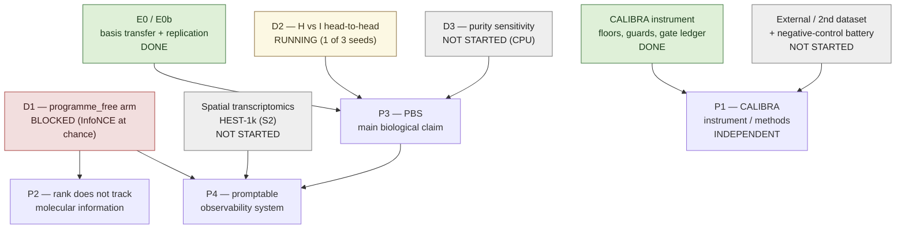

# MORPHEUS Lab Notebook
Running log of experiments, failures, fixes and results. Newest first.

All times are UTC. The GPU box (`ubuntu@132.145.196.200`) runs in UTC, so file
mtimes quoted below are UTC directly. Commit timestamps are recorded in the
repository as `-0400` and are converted to UTC here. Where no timestamp exists in
any source, the entry says so.

## Index

| Time (2026-08-01) | Entry | Outcome |
|---|---|---|
| 20:35 | D2 seed 42 — both arms complete; held-out representation geometry measured | RESULT |
| 20:04 | D2 seed 43 arm H — G2.6 flat from step 0 | FAILURE (open blocker) |
| 17:56 | D1 `programme_free` — InfoNCE term sits at chance | FAILURE (open blocker) |
| 17:45 | G2.6 memorisation queue sized to the check, not to training | FIX |
| 17:31 | G2.6 was grading a post-divergence loss | FIX |
| 17:15 | G2.6 failure message now prints the descent trajectory | FIX |
| 17:08 | G2.4 compared two different objectives across the warmup boundary | FIX |
| 16:47 | Correction — the shuffled G2.6 batch did not clear the gate | FAILURE |
| 16:44 | G2.6 liveness batch drawn shuffled rather than in identifier order | FIX |
| 16:44 | D2 arm H failed G2.4 after all 40 epochs had been paid for | FAILURE |
| 15:31 | NaN structure loss and the undecidable overfit gate | FIX |
| 10:02 | G2.6 non-finite for D2 arm H; 0.306 reduction on 280 patients for D1 | FAILURE |
| 09:18 | Legibility-operator alpha grid; retained-graph OOM | FIX |
| 09:08 | Legibility operator returned no nonzero axes; D1 OOM'd a 40 GB A100 | FAILURE |
| 09:07 | PBS target build (k=128, v2) bound to the maximal split | SETUP |
| 09:05 | Maximal paired split rebuilt, 6,192 -> 6,427 patients | SETUP |
| 09:03 | G0.2 failed on a file the previous experiment wrote | FIX |
| 09:01 | Hallmark scores rebuilt from the PanCan RNA table | SETUP |
| 08:52 | D2 refused: programme supervision did not cover the development fit set | FAILURE |
| 07:55 | D2 preflight refused: loaded paired cohort contains unassigned patients | FAILURE |
| 07:43 | PBS builder — RNA log transform, non-finite genes, missing-RNA exclusion | SETUP |
| 07:35 | Phase-D orchestration committed to the deployment bundle | SETUP |

Sections: [Publication Plan](#publication-plan) · [Notes to future agents](#notes-to-future-agents) ·
[Running log](#running-log).

---

# Publication Plan

Four target papers. This section is a map, not a claim: it records which *already measured* things
would support which paper, and the literal condition that must be true before anything is submitted.
Nothing below is evidence in itself. Every claim listed here must pass `validate_claim()` in
`v2/calibra/claim_guards.py` before it is written up; where a blocker is undischarged it is named.

Status vocabulary: **DONE** (measured, artifact on disk), **RUNNING** (started, incomplete),
**BLOCKED** (cannot proceed until a named failure is diagnosed), **NOT STARTED**.

---

## P1 — Instrument / methods paper (CALIBRA)

**Working title:** *Calibrated auditing of multimodal representation claims: spike-recovery floors for
morphology–molecular analyses.*

**Claim (one sentence):** A spike-recovery instrument that reports what effect size a given analysis
*would have missed*, distinguishing a paired **transmission floor** from an unpaired **detection
floor** — two quantities that are routinely conflated and are not interchangeable.

**Venue class:** methods journal or methods track (Nature Methods / Bioinformatics class), or a
methods-track ML venue. Not a biology venue: the deliverable is an audit procedure, not a finding
about tumours.

### Evidence ledger

| evidence item | status | where it lives | what would falsify it |
|---|---|---|---|
| The three nested spike-readout defects and their fix: (a) recovery scored with `top_canonical_correlation`, a maximum over 16 components, while the spike lives on one known direction; (b) partial replacement, because `a` was standardised and `y·v` was not; (c) absolute value taken *before* pairing, destroying the paired comparison since induced correlation has random sign | DONE | `HANDOFF_PHASE_D.md` §0; `v2/calibra/` | a post-fix recovery curve that still returns `NaN` on real data, or a fourth defect of the same class found in the same readout |
| Ambient correlation sits at ~0.97, so every pre-fix detection floor returned `NaN` on real data while all 11 synthetic self-tests passed | DONE | `HANDOFF_PHASE_D.md` §0 | synthetic tests that *do* discriminate the defect (would remove the paper's motivating example) |
| Confound adjustment does **not** destroy signal — attenuation 0.94–1.23, i.e. ≈1 | DONE | `HANDOFF_PHASE_D.md` §0 | attenuation far from 1 under a differently constructed confound design at comparable rank |
| **Residualising two orthogonal signals through a shared confound design INDUCES correlation between them** — 0.067–0.140, 99-column cancer+TSS design, n = 2,530. This is the novel methodological observation and the reason the floor is read with a paired test | DONE | `HANDOFF_PHASE_D.md` §0 | induced correlation ≈ 0 at matched design rank and n on a second design, i.e. the effect is specific to this one design rather than to shared residualisation |
| Two floors exist and are not interchangeable: `transmission_floor` (paired, near-noiseless, never quotable as a detection limit) and `detection_floor` (unpaired, conservative, ≈0.2 WSI) | DONE | `HANDOFF_PHASE_D.md` §0 | a construction where the paired floor is the correct detection limit |
| Gate-vs-observation separation: `GateLedger.add(gate, value, threshold, passed, …)` for pass/fail vs `GateLedger.observe(gate, value, expectation, …)` for recorded-but-not-graded quantities | DONE | `v2/calibra/gates.py:11,20,25` | a scientific outcome found wired into a pass/fail gate (which would show the separation is not enforced in practice) |
| `claim_guards` as executable claim admissibility — six blockers, each with mechanism and discharge condition, plus 15 tests | DONE | `v2/calibra/claim_guards.py`; `tests/test_claim_guards.py` | a blocker dischargeable without new evidence, or an unknown claim kind defaulting permissive |
| Worked liveness-gate failure cases: G2.4 straddling the warmup boundary (17:08); G2.6 reading a post-divergence loss (17:31); G2.6 graded against a 4,096-key stale queue (17:45); G2.6 undecidable at 280 patients (15:31) | DONE | this notebook, entries 15:31–17:45 | — (these are recorded observations, not inferences) |
| External / second-dataset demonstration of the floors | NOT STARTED | — | the floors do not transfer, or invert, on a second dataset |
| Written negative-control battery (must-fail controls and must-pass positive controls, run and reported including losses) | NOT STARTED | specification exists in `v2/research/rebase/MULTIMODAL_EXPANSION.md` §9 | any "must fail" control that passes — site/scanner/batch prediction from certified axes, random gene sets clearing the floor, shuffled gene labels leaving attribution intact, or modality-shuffled pairing preserving cross-modal agreement |

### Phase gate

> One external / second-dataset demonstration of both floors has been run **and** the negative-control
> battery of `MULTIMODAL_EXPANSION.md` §9 has been executed and written up, with every "must fail"
> control observed to fail and every positive control observed to pass, reported including the ones
> that go against us.

### Known blockers

- No external cohort has been through the instrument. `claim_guards.no_external_cohort` is
  undischarged for every morphology result on the project (all TCGA, with documented site and scanner
  effects).
- The induced-correlation observation currently rests on **one** design (99-column cancer+TSS) at
  **one** n (2,530). A methods paper asserting a general phenomenon needs it at a second design rank.
- The negative-control battery is a specification, not run output.

**Assessment:** least blocked of the four. It is also the only one of the four whose remaining
evidence does not depend on a GPU run completing.

---

## P2 — "Effective rank does not track molecular information"

**Working title:** *Representation-geometry metrics are uninformative about the molecular channel:
a two-directional demonstration, and a withdrawn claim.*

**Claim (one sentence):** Representation-geometry metrics used as quality proxies (effective rank,
per-feature spread) carry no information about the molecular channel, shown in **both** directions —
rank up with the channel flat, and rank down with the channel unchanged.

**Venue class:** methods/analysis, or a short negative-result or commentary format. The withdrawal of
F2 is part of the submission, not an omission from it.

### Evidence ledger

| evidence item | status | where it lives | what would falsify it |
|---|---|---|---|
| **+107% effective rank at flat within-cancer specificity** | DONE | `HANDOFF_PHASE_D.md` §0 | a protocol-matched measurement in which a rank increase does track specificity |
| **−17% effective rank (38.48 → 32.06) with the molecular channel unchanged (0.4768 → 0.4748)** | DONE | `HANDOFF_PHASE_D.md` §0 | channel moving with rank under the same protocol |
| **F2 is WITHDRAWN.** E3 measured `wsi_identity` changing by **2.6e-04** between `full` and `identity_only`, against **1.4e-01** for the biology head: the identity head is the frozen MLP-CLIP teacher passed through, so "molecular supervision degrades the molecular channel" restated a distillation observation | DONE — **the withdrawal is part of the story and must be reported, not hidden** | `HANDOFF_PHASE_D.md` §0 | a trained (not passed-through) identity arm reproducing F2's gap |
| At initialisation, WSI biology states are **0.7362 mutually collinear (std 0.0314)** against RNA **0.2740 (std 0.0508)** | DONE (supporting, measured 2026-08-01) | measurement of 2026-08-01 | the same statistic at comparable magnitude in both modalities, or a strong dependence on the initialisation seed |
| D2 seed-42 held-out geometry: arm H effective rank 19.655 vs arm I 10.777, mean feature std 0.01026 vs 0.00464, n = 2,766 test patients — with the channel comparison **not yet run** | RUNNING (descriptive only; not an endpoint) | this notebook, 20:35 | — |
| Trained objective-ablation arm (D1 `programme_free` vs `programme_only`, 3 seeds, paired bootstrap on the between-arm difference) — the arm F2 never had | BLOCKED | D1; `programme_free` InfoNCE sits at chance, ln(80) = 4.38 against measured 4.27 / 4.33 | the arm training normally and the channel tracking rank |

### Phase gate

> **Either** D1 supplies the trained objective-ablation arm that F2 lacked — both arms trained under
> one command differing only in `--objective-profile`, seeds 42/43/44, measured with
> `run_calibra` against `frozen_rna_targets.npz` plus a paired bootstrap on the between-arm
> difference — **or** the paper is written explicitly as a negative / methodological result on the two
> existing directions, with the F2 withdrawal reported in full and **no** objective claim made.

Those are genuinely two different papers. The first is "supervision choice does X to the channel";
the second is "stop using rank as a proxy". Only the second is available today.

### Known blockers

- D1 is blocked at G2.6: the `programme_free` contrastive term does not move off chance at two
  learning rates an order of magnitude apart, while `full_consistency` in the same objective reaches
  ~1e-4. Candidate causes recorded at commit `5fe082e`: WSI/RNA pairing after `_truncate_batch`, and
  ID-aware masking in `paired_infonce_with_memory` possibly excluding the positive.
- F2's withdrawal removes the only "objectives" framing that was previously drafted; any surviving
  draft text asserting "molecular supervision degrades the molecular channel" must be deleted.
- The collinearity datum is measured **at initialisation only**. It does not yet say anything about a
  trained representation.

---

## P3 — Main biological claim: Perturbation-Basis Supervision (PBS)

**Working title:** *Perturbation-basis supervision: interventional coordinates make tumour morphology
molecularly legible where curated pathway scores do not.*

**Claim (one sentence):** Supervising morphology on **interventional perturbation coordinates** yields
molecular legibility that **curated pathway scores do not**.

**Venue class:** high-impact biology / computational biology, conditional on the phase gate. If the
gate does not clear, there is no P3 in this form.

### Evidence ledger

| evidence item | status | where it lives | what would falsify it |
|---|---|---|---|
| E0 feasibility: responsive perturbations align with TCGA expression geometry more than non-responsive ones, `verdict = supported`, K562, at **~10–11% of the achievable ceiling**, paired CI entirely above zero at every k; the non-responsive control absorbs **55%** of the raw overlap at k=100 | DONE | `v2/research/rebase/nature/E0_RESULT.md` | the gap vanishing against a control matched on effect magnitude, or against a non-tumour bulk-RNA target |
| E0 cross-lineage replication, n-matched at 168 per arm: K562 **+0.0387** vs RPE1 **+0.0394** at k=25 — agreement within 2% across a near-triploid CML line and a near-diploid retinal epithelial line; 4/4 contexts decided; monotone in the preregistered control-threshold sweep | DONE | `v2/research/rebase/nature/E0_REPLICATION_RESULT.md` | divergence between lineages once matched on n, or non-monotone behaviour under the control threshold |
| The n-matching was load-bearing: uncapped, K562 reads +0.0671 vs +0.0496 — a **35% inflation from sample size alone** that would have been reported as lineage specificity | DONE | `E0_REPLICATION_RESULT.md` §2 | — |
| E0b: 8,403 perturbations have **effective rank 132.1** (RPE1 113.9), stable rank 17.4, coherence 0.85 — the dictionary's resolution ceiling, and the reason `n_components = 128` | DONE, with the caveat that `n_equivalence_classes` returned *n* and is mis-specified and unusable | `E0_RESULT.md` §5 | a corrected equivalence-class count inconsistent with an effective rank of ~132 |
| PBS supervision target `pbs_targets_k128_v2.npz` built on the maximal split, dictionary fit on development rows only, `signed_log1p` matching E0's `_load_tcga` | DONE | this notebook, 09:07; `.manifest.json` | a leak of test-split information into the transform or the dictionary fit |
| Hallmark baseline rebuilt on the same expression source, agreeing with the frozen table at per-set Spearman ≥ 0.99999991 across all 50 sets | DONE | this notebook, 09:01 | — |
| **D2 head-to-head, arms H and I, 3 seeds, matched by construction via `D2_PAIR_MANIFEST.json`; the paired patient+cancer bootstrap on the H−I difference is the predeclared primary** | RUNNING — seed 42 both arms complete; seed 43 arm H failed G2.6; seed 44 never started; `d2_compare` not run (`compare.log` 0 bytes, no `D2_SEED42_BOOTSTRAP.json`) | this notebook, 20:35 and 20:04 | I ≈ H — overlapping paired-bootstrap CIs |
| **D2.3 per-axis proliferation / essentiality annotation** — answers the proliferation confound for free, since per-axis gene loadings exist anyway: if every legible axis is proliferation-loaded, that is the deflation, visible without a separate experiment | Target built (128 axes annotated, `pbs_targets_k128_v2.npz.axis_annotations.csv`); **analysis NOT STARTED** | this notebook, 09:07 | every legible axis coming back proliferation-loaded |
| D3 purity sensitivity — purity into `confound_design` in `v2/calibra/run_calibra.py`, channel reported before and after | NOT STARTED (CPU; no TCGA purity table on disk) | `HANDOFF_PHASE_D.md` §D3 | the channel dying when purity enters the adjustment set (which is a finding, to be reported, not buried) |

### Phase gate

> A D2 `SUCCESS.json` with all gates passed for **all six runs** (2 arms × seeds 42/43/44), **and**
> non-overlapping paired patient+cancer bootstrap CIs on the H−I difference in the predeclared
> direction.
>
> If **I ≈ H** (overlapping CIs), the interventional dictionary's content already sits inside curated
> pathways, **the rebase premise is in trouble, and this paper does not exist in this form.** That
> outcome is escalated per `HANDOFF_PHASE_D.md` §D2.3, not rewritten into a weaker claim.

### Known blockers

1. **E0 remains an INADMISSIBLE `transfer` claim** under `claim_guards`: `proliferation_deflation`
   and `single_platform` are both undischarged, pinned by
   `test_current_e0_result_is_not_yet_an_admissible_transfer_claim`. If either is discharged, that
   test fails and must be updated deliberately.
2. **Single platform.** Everything perturbational is Replogle Perturb-seq — one protocol (CRISPRi +
   scRNA-seq), one normalisation, one pseudobulk procedure, one effect-size-monotone
   `energy_test_p_value`. Two lineages is not two platforms; cross-lineage agreement rules out "a K562
   quirk", never "a Perturb-seq quirk".
3. **D2 rests on one seed.** Seed 43 arm H failed G2.6 flat from step 0 (best value at step 0); seed
   44 was never launched.
4. **The `d2_compare` interval is not a 95% CI.** It bootstraps an in-sample multivariate top-CCA
   maximum; the direction of the paired difference is quotable, the width is not.
5. **The WSI-collinearity confound measured 2026-08-01.** WSI biology states are 0.7362 mutually
   collinear at initialisation against RNA's 0.2740. A *narrower* PBS representation may therefore
   reflect resistance to an already-collapsed view rather than dictionary content — so arm I's lower
   effective rank (10.777 vs 19.655) cannot currently be read as evidence either for or against PBS.
6. `purity_confound`, `composition_attribution` and `no_external_cohort` are undischarged for any
   `legible_axis` claim; D3 addresses only the first.

---

## P4 — System paper: promptable multiscale causal observability

**Working title:** *A certified promptable interface over a multiscale causal observability atlas.*

**Claim (one sentence):** A **certified** promptable interface over the representation — natural-language
queries answered only from axes that carry a certificate, with uncertified axes visible and marked as
such rather than returned as answers.

**Venue class:** systems / resource paper. **This is the furthest out of the four and should be
described that way in every planning document: nothing for it has been started.**

### Evidence ledger

| evidence item | status | where it lives | what would falsify it |
|---|---|---|---|
| Per-axis certification working end to end: operator estimated on a discovery fold; axes clear the CALIBRA detection floor; confound certificate passed (axes must **fail** to predict site/scanner/batch); replication in untouched patients and ≥1 external cohort; failures exposed alongside successes | NOT STARTED | `MULTIMODAL_EXPANSION.md` §1 (the five-point prerequisite rule) | certified axes that do predict site/scanner/batch |
| A second target modality — spatial transcriptomics / HEST-1k (stage S2 of the build order) | NOT STARTED | `MULTIMODAL_EXPANSION.md` §2, §5 | S1 axes failing to replicate spatially, or cell-of-origin remaining unresolved |
| P3 landing (the representation being worth exposing at all) | depends on P3 | see P3 | — |
| D1's objective repaired (the ablation that says what the supervision is doing) | BLOCKED | see P2 | — |
| The promptable query layer itself | NOT STARTED | `MULTIMODAL_EXPANSION.md` §8 | — |

### Phase gate

> Per-axis certification working end to end (all five conditions of `MULTIMODAL_EXPANSION.md` §1)
> **plus** at least one modality beyond bulk RNA.

### Known blockers

- Everything. P4 is downstream of P3 landing, of D1's objective being repaired, and of the multimodal
  expansion supplying a second modality.
- The prerequisite rule is not negotiable: *you cannot prompt what you cannot certify.* A fluent
  interface over an uncertified representation is **worse than no interface**, because it launders
  uncertainty into prose.
- The build order S1 → S6 in `MULTIMODAL_EXPANSION.md` §2 must not be reordered, and the copilot is
  stage S6.

---

## Cross-paper dependency diagram



**Reading it:** P1 has no incoming edge from any pending experiment other than its own remaining
analysis work — it is independent of the GPU queue. P2 needs D1. P3 needs D2 and D3 (on top of E0,
already done). P4 needs P3, D1 and spatial.

## Timeline

No calendar dates. Sequencing is expressed as ordered dependencies plus rough effort. GPU effort is
scaled from the one observed data point: seed 42 arm H finished 18:49 and arm I finished 20:00, i.e.
roughly **1 h of A100 time per arm** at 40 epochs on the 6,427-patient split.

| paper | phases that must complete, in order | sequencing note |
|---|---|---|
| **P1** | (1) external / second-dataset spike demonstration → (2) negative-control battery run per `MULTIMODAL_EXPANSION.md` §9 → (3) write-up | Independent of the GPU queue; both remaining items are analysis-scale and can start **now**, in parallel with D2 training. Rough effort: days of CPU analysis, no training. This is the one that can move while everything else is blocked. |
| **P2** | (1) diagnose the `programme_free` InfoNCE failure (pairing after `_truncate_batch`; ID-aware masking in `paired_infonce_with_memory`) → (2) D1 both arms × seeds 42/43/44 → (3) `run_calibra` on the 6 artifacts against `frozen_rna_targets.npz` + paired bootstrap → (4) write-up | Entirely gated on the D1 diagnosis, which is a code question, not a compute question — cheap to attempt, unbounded until it lands. Step (2) is ~6 h GPU at the observed per-arm rate. **The fallback path — writing P2 as a negative/methodological result on the two existing directions plus the F2 withdrawal — needs no GPU and is available immediately.** |
| **P3** | (1) diagnose the seed-43 G2.6 initialisation failure → (2) complete D2 seeds 43 and 44, both arms (~4 h GPU for the four remaining arms at ~1 h each) → (3) `d2_compare` primary readout + paired patient+cancer bootstrap (minutes, CPU) → (4) D2.3 per-axis proliferation/essentiality analysis (CPU, on annotations already built) → (5) D3 purity sensitivity (CPU, **runs in parallel from step 2**; needs the TCGA consensus purity table, or an expression-derived estimate flagged `purity_source="expression_derived"`) → (6) write-up | The critical path is the GPU queue plus the seed-43 diagnosis. D2.3 and D3 cost no GPU and should be run alongside, not after. Step (1) must not be skipped by dropping to one seed — the phase gate requires three. |
| **P4** | (1) P3 clears its phase gate → (2) D1 objective repaired → (3) spatial modality acquired and S1 axes replicated spatially (stage S2) → (4) per-axis certification end to end, all five conditions → (5) write-up | Strictly after P2 and P3, with a new data acquisition in the middle. Effort is dominated by (3) and (4), neither of which has been scoped. Describe as long-horizon; do not put it on any near-term plan. |

---

# Notes to future agents

Standing instructions for whoever — human or agent — picks this up next.

1. **Log every run, every error and every result here**, with date, time (UTC), the exact command or
   module, and a *Meaning for the claim* line. An unlogged run is an unrepeatable run. Entries are
   newest-first; keep the Index table in sync.

2. **Never report a bug fix as a scientific result.** Most of this notebook is infrastructure. A fix
   licenses nothing — it unblocks measurement. If an entry's *Meaning for the claim* line cannot say
   what would falsify the thing being claimed, it is not a result.

3. **The gates are fail-closed by design. If a gate blocks, diagnose it — do not relax it.** The
   canonical case is on 2026-08-01: G2.6 was failing, and the obvious "fix" was to raise the step
   count. That would have been exactly wrong. At lr 1e-2 the objective descends to 0.9432 by step 250
   and then *diverges* — the gate at step 299 was reading 2.1575, i.e. grading a post-divergence loss,
   and by ~2000 steps the heteroscedastic Gaussian NLL reaches `nan` as its variance head collapses
   under AdamW. More steps would have made it strictly worse. Two earlier hypotheses for the same gate
   — too few steps, wrong batch composition — were also both wrong. Relaxing a threshold to make a run
   proceed converts a diagnosable failure into an undiagnosable result.
   *Corollary:* a gate that cannot fail cleanly certifies nothing (see 15:31: a 280-patient
   memorisation check was undecidable, not failing), and a gate must emit the evidence it graded (see
   17:15).

4. **Any claim must pass `validate_claim()` in `v2/calibra/claim_guards.py` before it is written up.**
   Six blockers are encoded — `composition_attribution`, `purity_confound`, `sign_blind`,
   `proliferation_deflation`, `single_platform`, `no_external_cohort` — each with the mechanism by
   which the claim goes wrong *while the numbers look fine*, and the specific evidence that discharges
   it. An unknown claim kind is inadmissible by default. If a verdict is inadmissible, emit the repo
   status convention (`value = NaN`, `note = "inadmissible_<code>"`) so it is **visible**, never a
   silent drop. Discharging a blocker will break
   `test_current_e0_result_is_not_yet_an_admissible_transfer_claim`; update that test deliberately, as
   a decision, never as a test repair.

5. **Record measured numbers only.** If a number was not measured, write "pending" or "not measured".
   Do not interpolate, do not round a remembered figure, do not carry a number across a cohort or
   estimator change. Where a number came from a session probe that did not persist to disk, say so
   explicitly (see 20:04). Numbers that must not be quoted at all are listed in
   `HANDOFF_PHASE_D.md` §4 — `n_equivalence_classes`, the marginal `bootstrap_ci95` as a 95% CI, the
   `d2_compare` interval width, and anything from F2.

6. **There are two isolated checkouts on the GPU box: `~/morpheus-rebase` and `~/morpheus-rebase-d1`.**
   This is deliberate. D1 and D2 are being debugged concurrently, and a mid-experiment code change
   makes seeds incomparable: seeds 42, 43 and 44 of the same arm are only a replication if they ran
   the same code. Keeping D1's debugging out of the checkout D2 is running from is what preserves that.
   Do not consolidate them, and do not fix a D1 bug in the D2 checkout while D2 is mid-flight. Related:
   G0.2 requires a clean committed worktree per run, and every artifact records `git_commit` and
   `git_dirty` — the seed-42 D2 artifacts record `git_dirty: true`, which is why G0.4 cannot be
   discharged from disk for them.

7. **Before any GPU run, complete the recursive audit loop in `HANDOFF_PHASE_D.md` §2.** Two prior
   audits each caught a defect that would have produced a confident, wrong answer, and both defects
   passed their own test suites. Do not argue an auditor into a GO; fix the code.

---

# Running log

---
## 2026-08-01 20:35 UTC — D2 seed 42: both arms trained 40/40 epochs; held-out representation geometry measured
**Status:** RESULT
**Experiment:** D2
**Logged:** 2026-08-01 20:35 UTC
**How obtained:** `phase_d d2` from `~/run_d2_final.sh` on the GPU box (seed 42, arms H and I); held-out geometry computed directly from the exported diagnostic artifacts `~/e0_run/d2_final/artifacts/d2_{h,i}_seed42.npz`, `split == "test"` rows only, effective rank as `exp(H(s))` on the singular values of the column-centred patient x feature matrix. Training numbers read from `TRAIN_SUCCESS.json`, `liveness.json`, `selection.json` and `train_metrics.jsonl`.

### What was run
`phase_d d2` on the GPU box, arms H (Hallmark supervision) and I (PBS
interventional coordinates), seed 42, from `~/run_d2_final.sh`. Arm H finished at
18:49, arm I at 20:00. Diagnostic artifacts were exported at 20:33 (H) and 20:35 (I).
Representation geometry was then computed from those two artifacts on the
held-out test partition.

### Method
Both arms use `--objective-profile programme_only` and differ only in the
supervision target: arm H uses the Hallmark score table, arm I uses
`pbs_targets_k128_v2.npz`. Matching is by construction — a single
`D2_PAIR_MANIFEST.json` enumerates the 40 common arguments and both arms record the
same `pair_manifest_sha256`. Effective rank is
`exp(H(s))` where `s` is the singular-value distribution of the column-centred
patient x feature matrix (Roy–Vetterli entropy on singular values, not on squared
singular values). Feature std is the mean over the 256 output features of the
per-feature standard deviation across test patients.

### What happened
Both arms completed 40/40 epochs and wrote `TRAIN_SUCCESS.json` with
`liveness_passed: true`. On the 2,766 held-out test patients, the WSI biology state
of arm H has a higher effective rank and roughly double the per-feature spread of
arm I. The predeclared primary readout (`legibility_weighted_grouped_cv` via
`d2_compare`) has **not** been run: `~/e0_run/compare.log` is 0 bytes and
`~/e0_run/d2_final/D2_SEED42_BOOTSTRAP.json` does not exist. The numbers below are
descriptive geometry, not the endpoint D2 was preregistered on.

### Technical
- Test partition n = 2,766 (`split == "test"` in both artifacts; 6,427 rows total).
- `wsi_biology`, test rows only:

  | arm | effective rank | mean feature std |
  |---|---:|---:|
  | H (Hallmark) | 19.655 | 0.01026 |
  | I (PBS k=128) | 10.777 | 0.00464 |

- Same statistic on the other exported states (recorded, not interpreted):
  `rna_biology` H 7.353 / I 8.273; `full_biology` H 7.493 / I 8.387. Mean feature
  std `rna_biology` H 0.05235 / I 0.04738; `full_biology` H 0.05207 / I 0.04685.
- Training: 40 rows in each `train_metrics.jsonl`. Arm H epoch 0 `train_loss`
  0.603548 -> epoch 39 `train_loss` 3.252888; arm I epoch 0 0.623134 -> epoch 39
  3.483169. The rise across the warmup boundary is expected (see the 17:08 entry);
  the comparable figures are H `loss_initial_comparable` 5.226369 with
  `loss_relative_reduction` 0.377601, and I 5.293064 with 0.341937, both read from
  the first post-warmup epoch (`loss_comparable_from_epoch: 4`).
- G2.6 memorisation, 16 patients, 800 steps: arm H 2.306629 -> -0.808859
  (`relative_reduction` 1.350667, best -1.900944 at step 325); arm I 1.260693 ->
  -1.875757 (`relative_reduction` 2.487878, best -5.691144 at step 575). Both
  `still_descending: true`.
- Shared configuration (`D2_PAIR_MANIFEST.json`, `common_config_sha256`
  `b7b2441fd9d03a3a00152027efe8c7ada3bedc48e7939f1dfc0b320b02adf1fb`): epochs 40,
  learning_rate 2e-4, hidden_dim 512, layers 4, heads 8, programme_head_dim 256,
  token_budget 8192, loss_warmup_epochs 4, programme_weight 1.0,
  programme_neighbourhood_weight 0.2, programme_supcon_weight 0.2,
  programme_warmup_weight 0.5, decorrelation_weight 0.04, variance_weight 0.01,
  separation_weight 0.01, weight_decay 0.01, restrict_to_split true.
  `pair_manifest_sha256` `ce1352e0ac7a98334e4fada8178986e8413fac1046ebb67a96f5c3cbc7c2fb0b`
  in both `TRAIN_SUCCESS.json` files.
- Model selection: `selection.json` records `"selection": "fixed_final_epoch"` for
  both arms; `anchor_validation_r10` is `NaN`, `best_retrieval_r10` and
  `best_programme_pearson` are `-Infinity`. No validation-based selection was
  performed and no retrieval metric was measured.
- Provenance caveat: both artifact `source_manifest` blocks record
  `git_commit: 503c36b677f1af4206f2f4fb97c23336d5564316` with `git_dirty: true`.
  Per `HANDOFF_PHASE_D.md` §D1.0 this means G0.4 cannot be discharged from disk for
  these artifacts. `configuration_sha256` differs across arms
  (H `767fb363…`, I `7799261…`), which is expected since the target differs.
- Seed 43 did not complete; seed 44 was never started. This is one seed, not the
  three the launch plan declares.

### In plain terms
Two models were trained that are identical in every respect except what they were
asked to predict from the tumour slide: one predicted 50 classical biological
pathway scores, the other predicted 128 coordinates derived from a CRISPR
perturbation experiment. On 2,766 patients from cancer types neither model was
trained on, the pathway-supervised model's slide representation spreads across
roughly twice as many independent directions and varies about twice as much per
feature. This says the two supervision choices leave visibly different geometry in
the model; it does **not** yet say which one predicts biology better, because the
comparison test that would answer that has not been run.

### Meaning for the claim
This licenses a statement about **geometry only**: two supervision targets leave measurably different structure in the held-out slide representation. It does **not** license any statement about which supervision is more molecularly legible, because the predeclared primary readout (`legibility_weighted_grouped_cv` via `d2_compare`, with the paired patient+cancer bootstrap) has not been run and the run rests on one seed of three. It feeds **P3** as the first half of the head-to-head, and **P2** as a further instance of effective rank moving while the molecular channel is unmeasured.

### Files / commits
- `~/e0_run/d2_final/d2_h_seed42/` and `~/e0_run/d2_final/d2_i_seed42/`
  (`TRAIN_SUCCESS.json`, `liveness.json`, `selection.json`, `train_metrics.jsonl`)
- `~/e0_run/d2_final/artifacts/d2_h_seed42.npz`, `~/e0_run/d2_final/artifacts/d2_i_seed42.npz`
- `~/e0_run/d2_final/D2_PAIR_MANIFEST.json`, `~/e0_run/d2_final/D2_LAUNCH_PLAN.json`
- `~/run_d2_final.sh`
- code at `503c36b` (dirty worktree)
- pending: `~/e0_run/d2_final/D2_SEED42_BOOTSTRAP.json`, `~/e0_run/compare.log`

---
## 2026-08-01 20:04 UTC — D2 seed 43, arm H: G2.6 is flat from step 0
**Status:** FAILURE
**Experiment:** D2
**Logged:** 2026-08-01 20:04 UTC
**How obtained:** G2.6 pre-training gate inside the same `phase_d d2` invocation, seed 43 arm H; failure text read verbatim from `~/e0_run/d2_final.log`. The seed-43 vs seed-42 liveness-batch comparison was run in-session and **not persisted to disk**.

### What was run
The seed-43 arm of the same `phase_d d2` invocation, launched automatically after
seed 42 arm I completed at 20:00. It failed the pre-training G2.6 memorisation gate
and `phase_d` refused to continue, so seeds 43 and 44 produced no checkpoints.

### Method
G2.6 truncates the liveness batch to 16 patients and runs 800 optimiser steps on the
actual encoder and programme path, recording the loss every 25 steps. It requires a
practically memorised objective.

### What happened
The loss did not descend at any point. The best value in the entire 800-step run was
the value at step 0, and the trajectory was level from step ~300 onward. The measured
reduction was negative.

### Technical
Verbatim from `~/e0_run/d2_final.log`:

```
RuntimeError: G2.6 programme_only overfit failed before training: loss=2.47202,
programme=2.47202, reduction=-0.053; best=2.34552001953125 at step 0,
still_descending=False, trajectory=[(0, 2.3455), (75, 2.3931), (150, 2.3805),
(225, 2.5836), (300, 2.4766), (375, 2.4741), (450, 2.4733), (525, 2.4724),
(600, 2.4718), (675, 2.4722), (750, 2.4735)]; expected a practically memorised
actual-model objective
```

followed by `RuntimeError: D2 H seed 43 failed; do not compare incomplete arms`,
`D2_EXIT=1`. `~/e0_run/d2_final/d2_h_seed43/` exists and is empty.

Contrast with seed 42 arm H under identical configuration: 2.306629 -> -0.808859,
best -1.900944 at step 325. Same code, same split, same targets, same 40 common
arguments; only the seed differs.

Diagnosis recorded during the session: the failure is initialisation-dependent, not
batch-dependent. The seed-43 and seed-42 liveness batches were compared and were
comparable, with target standard deviations of 0.87 (seed 43) against 0.97
(seed 42). **The probe that produced these two numbers did not persist its output to
the box**, so they are recorded here from the session and are not reproducible from a
file on disk. Everything else in this entry is read from `~/e0_run/d2_final.log`.

Open. No fix attempted. Seeds 43 and 44 are unmeasured, so D2 currently rests on a
single seed.

### In plain terms
The gate that checks a model can at least memorise sixteen patients before spending
GPU time on it failed for the second random starting point. The loss never went
down at all — the very first step was the best the run ever got. Because the same
setup works for the first random start, the problem appears to be where the model
happens to start rather than which patients it was given, but that has only been
checked once and the check was not saved.

### Meaning for the claim
Licenses nothing scientifically. Its consequence is scheduling: D2 currently rests on a single seed, which is below **P3**'s phase gate of three seeds with non-overlapping paired-bootstrap CIs. Until the initialisation dependence is diagnosed, no D2 number may be quoted as a multi-seed result.

### Files / commits
- `~/e0_run/d2_final.log`
- `~/e0_run/d2_final/d2_h_seed43/` (empty)

---
## 2026-08-01 17:56 UTC — D1 `programme_free`: the InfoNCE term sits at chance
**Status:** FAILURE
**Experiment:** D1
**Logged:** 2026-08-01 17:56 UTC
**How obtained:** Three G2.6 runs of the `programme_free` arm on the real runner (`python -m morpheus.v2.runner`, 800 steps, 16-patient truncation), varying only memory-queue size and learning rate; numbers read from `~/e0_run/d1_pf2.log` and `~/e0_run/d1_probe_free.log`.

### What was run
Three G2.6 runs of the `programme_free` arm on the real runner, 800 steps each, all
other settings identical, varying only the memory-queue size and the learning rate.

### Method
`programme_free` removes the Hallmark regression, neighbourhood and supcon terms
(see `HANDOFF_PHASE_D.md` §D1.1); what remains is a paired InfoNCE contrastive term
plus a full-consistency term, with the decorrelation weight unchanged from
`programme_only`. G2.6 truncates to 16 patients. With 16 in-batch patients and a
64-key queue there are 80 candidates, so chance-level cross-entropy is
ln(80) = 4.38.

### What happened
The contrastive term did not move off chance at either learning rate. The
consistency term, inside the same objective and the same model clone, reached ~1e-4.

### Technical
| queue | lr | contrastive | reduction |
|---:|---:|---:|---:|
| 4096 | 1e-3 | 5.62201 | 0.070 |
| 64 | 1e-3 | 4.26618 | 0.115 |
| 64 | 1e-2 | 4.33044 | 0.102 |

Chance = ln(80) = 4.38. Measured 4.27 at lr 1e-3 and 4.33 at lr 1e-2 — two learning
rates an order of magnitude apart, both at chance. In the same runs
`full_consistency` was 0.00211 (lr 1e-3) and 0.00011 (lr 1e-2), i.e. gradients reach
the model and the clone does optimise.

Verbatim, `~/e0_run/d1_pf2.log` (17:55):

```
RuntimeError: G2.6 programme_free overfit failed before training: loss=4.33055,
contrastive=4.33044, full_consistency=0.00011, reduction=0.102; expected near-zero
terms and >=80% reduction
```

`~/e0_run/d1_probe_free.log` (17:50) records the lr 1e-3 run:
`loss=4.26830, contrastive=4.26618, full_consistency=0.00211, reduction=0.115`.

The gate was not relaxed. Candidate causes to check next, recorded in commit
`5fe082e`: (a) whether the WSI and RNA views are paired on the same patient index
after `_truncate_batch`, (b) whether `paired_infonce_with_memory`'s ID-aware masking
excludes the positive.

Open. D1 cannot produce a comparison until this arm trains, and D1 is the experiment
that would supply the arm withdrawn with F2 (`HANDOFF_PHASE_D.md` §0).

### In plain terms
The `programme_free` model is supposed to learn by matching each patient's slide to
that same patient's RNA among a set of decoys. Its score is stuck at exactly the
value you would get by guessing at random, and it stays there when the learning rate
is raised tenfold. A second term in the same objective goes essentially to zero over
the same steps, so the model is learning — it just cannot learn this particular
matching task, which points at how the task is set up rather than at how long it
was trained.

### Meaning for the claim
Licenses nothing about objectives. It is the open blocker on D1, and D1 is the experiment that must supply the trained objective-ablation arm F2 never had. It therefore blocks **P2**'s stronger form and is one of the three prerequisites for **P4**. Note what it does *not* say: the model optimises fine (full-consistency reaches ~1e-4 in the same runs), so this is a task-construction problem, not evidence that contrastive supervision fails.

### Files / commits
- `5fe082eb696e438bb5421ff6e1cb53d78dfd1be6`
- `~/e0_run/d1_pf2.log`, `~/e0_run/d1_probe_free.log`
- `C:\Users\mobar\OneDrive\biorag\morpheus-rebase\HANDOFF_PHASE_D.md` §D1.1

---
## 2026-08-01 17:45 UTC — G2.6 queue sized to the check, not to training
**Status:** FIX
**Experiment:** D1
**Logged:** 2026-08-01 17:45 UTC
**How obtained:** G2.6 on the real runner, 800 steps, with the training-sized 4,096-key memory queue; code change committed as `0a9c1d9`.

### What was run
G2.6 on the real runner, 800 steps, with the training-sized memory queue.

### Method
G2.6 asks whether the model can memorise one small batch and grades the contrastive
term at <= 0.10. The training queue holds 4,096 detached keys encoded by the
pre-optimisation model and never refreshed during the check.

### What happened
With 4,096 stale keys the <= 0.10 criterion is unreachable by construction: the model
would have to out-score thousands of vectors it cannot update. Measured over 800
steps, contrastive 5.62201 (reduction 0.070) while `full_consistency` — the term
with no stale queue behind it — reached 0.00023. The queue is now sized to the check.

### Technical
- Measured: contrastive 5.62201, reduction 0.070; full_consistency 0.00023.
- The queue path is still exercised: priming still runs and still validates the
  unique-key count, and the step-0 detached-group check still passes gradients
  through it.
- After this change the same arm reads 4.26618 at queue 64 (see the 17:56 entry),
  which is chance, so this fix removed a construction artefact and did not make the
  arm pass.

### In plain terms
The memorisation check was comparing each patient against thousands of stored
comparison vectors that were frozen before training started and never updated. No
healthy model could win that comparison, so the check could not distinguish a
working model from a broken one. It now compares against a small, current set.

### Meaning for the claim
Infrastructure only — it licenses nothing scientifically and only makes the gate decidable. It matters to **P1** as a worked example of an instrument whose pass criterion was unreachable by construction, which is exactly the failure mode CALIBRA's floors are designed to expose. It is not a result about the model: the arm still reads chance after the fix.

### Files / commits
- `0a9c1d98a3b1ca13c74dd83f2e94b24173bc831c`

---
## 2026-08-01 17:31 UTC — the G2.6 overfit gate was reading a post-divergence loss
**Status:** FIX
**Experiment:** D1
**Logged:** 2026-08-01 17:31 UTC
**How obtained:** The 16-patient memorisation check on the real runner at lr 1e-2, with the per-25-step trajectory instrumentation added at 17:15; committed as `503c36b`.

### What was run
The 16-patient memorisation check on the real runner at lr 1e-2, with the trajectory
recorded every 25 steps (instrumentation added at 17:15).

### Method
Compare the loss the gate scores against the loss trajectory that produced it.

### What happened
At lr 1e-2 the memorisation descends cleanly and then blows up inside the window the
gate reads, so the gate was scoring the divergence rather than the descent.

### Technical
Measured on the real runner:

```
step   0  2.4154
step 150  1.2822
step 250  0.9432   <- best
step 299  2.1575   <- what the gate scored, reduction 0.086
```

By ~2000 steps the same objective reaches `nan`; the heteroscedastic Gaussian NLL's
variance head collapses under AdamW at this rate. At lr 1e-3 with 800 steps the gate
passes on the real runner and training proceeds. Both D1 arms take the same setting,
since two liveness checks are comparable evidence only if run identically.

Recorded consequence: raising the step count on this gate makes it worse, not
better, and must not be done without addressing the NLL divergence first.

Earlier hypotheses for this gate — too few steps, wrong batch composition — were
both wrong.

### In plain terms
The check ran the model for a fixed number of steps and looked only at the number at
the end. At the higher learning rate the model did learn the batch and then became
numerically unstable, and the check happened to read the number after the
instability. So the model was passing and being marked as failing. Lowering the
learning rate makes the run stable across the whole window.

### Meaning for the claim
Infrastructure only — no scientific claim. Its standing value is the recorded consequence, which is cited in **Notes to future agents**: raising this gate's step count makes it worse, not better, because the heteroscedastic Gaussian NLL diverges to `nan` by ~2000 steps. As a methods exhibit it feeds **P1** (a gate that reads a single terminal number cannot distinguish divergence from failure to learn).

### Files / commits
- `503c36b677f1af4206f2f4fb97c23336d5564316`

---
## 2026-08-01 17:15 UTC — G2.6 failure message now prints the descent trajectory
**Status:** FIX
**Experiment:** infrastructure
**Logged:** 2026-08-01 17:15 UTC
**How obtained:** Source change to the G2.6 failure path only (`RuntimeError` message now prints the recorded per-25-step losses); committed as `8a8c1e0`. No experiment was run.

### What was run
Change to the G2.6 failure path only; no experiment.

### Method
Print the recorded per-25-step losses in the `RuntimeError` message instead of a
single terminal number.

### What happened
Applied. This is the instrumentation the 17:31 and 20:04 diagnoses were read from.

### Technical
A terminal number alone cannot distinguish a dead implementation from an
unconverged one from an unstable one, and the standalone offline probe used to
reason about the gate did not reproduce the runner (probe initial loss 1.358 against
the runner's 2.36). The trajectory is now emitted where the gate actually runs.

### In plain terms
When the pre-training check fails it now reports the whole learning curve, not just
the final number, so the failure can be diagnosed from the run itself rather than
from a separate script that behaves differently.

### Meaning for the claim
Licenses nothing scientifically; it is pure instrumentation that unblocked the 17:31 and 20:04 diagnoses. It is an illustration for **P1** of the gate-vs-observation separation (`GateLedger.add` vs `GateLedger.observe` in `v2/calibra/gates.py`): a gate must emit the evidence it graded, or its verdict cannot be audited.

### Files / commits
- `8a8c1e0b3c5019aa75d50f7456897b17f1105b44`

---
## 2026-08-01 17:08 UTC — G2.4 compared two different objectives across the warmup boundary
**Status:** FIX
**Experiment:** D2
**Logged:** 2026-08-01 17:08 UTC
**How obtained:** Re-derivation of the G2.4 criterion against `train_metrics.jsonl` across the `--loss-warmup-epochs 4` boundary, with the post-fix values read from `~/e0_run/d2_final/d2_h_seed42/liveness.json`; committed as `1cc1954`.

### What was run
Re-derivation of the G2.4 liveness criterion after the 16:44 failure, plus in-situ
G2.6 instrumentation.

### Method
G2.4 required the training loss to fall at least 20%. It read `train_loss` at
epoch 0 against epoch 39. The neighbourhood and supcon terms are off during warmup
and switch on at `--loss-warmup-epochs`, so the total necessarily jumps at the
boundary; epoch 0 and epoch 39 are not the same objective.

### What happened
The jump was measured at 0.528 (epoch 3) -> 5.330 (epoch 4). The run that failed had
fallen 5.33 -> 3.19 in the objective it actually optimised, a 40% reduction, and was
failed for "did not decrease >=20%" after all 40 epochs had been paid for. G2.4 now
reads the first post-warmup epoch. Epoch 0 is still recorded, and the old quantity is
retained as `loss_relative_reduction_from_epoch_zero`.

### Technical
- Measured warmup boundary: epoch 3 = 0.528, epoch 4 = 5.330 (`--loss-warmup-epochs 4`).
- Post-fix, seed 42 arm H `liveness.json`: `loss_initial` 0.603548,
  `loss_initial_comparable` 5.226369, `loss_comparable_from_epoch` 4,
  `loss_final` 3.252888, `loss_relative_reduction` 0.377601,
  `loss_relative_reduction_from_epoch_zero` -4.389610, `tail_loss_slope` 0.003018.
- G2.6 now records its own descent every 25 steps.

### In plain terms
The training objective legitimately changes after the first four epochs, because two
extra penalty terms switch on and push the total number up. The health check was
comparing a number from before the switch against a number from after it, so a run
that was steadily improving looked like it had got worse — and this was only
discovered after the full forty epochs of GPU time had been spent. The check now
compares like with like.

### Meaning for the claim
Infrastructure only — licenses nothing scientifically, and unblocks measurement by making the liveness check compare like with like. As a methods exhibit it feeds **P1**: a health check that straddles a scheduled objective change will fail healthy runs, and here it did so only after forty epochs of GPU time had been spent.

### Files / commits
- `1cc19542b15ffbdc51e038dd509a96069776b142`
- `~/e0_run/d2_final/d2_h_seed42/liveness.json`

---
## 2026-08-01 16:47 UTC — Correction: shuffling the G2.6 batch did not fix the D1 gate
**Status:** FAILURE
**Experiment:** D1
**Logged:** 2026-08-01 16:47 UTC
**How obtained:** The 16:44 shuffled-batch change re-run against the real runner at seed 42; failure text from `~/e0_run/d1_shuffled.log`, compared with `~/e0_run/d1_parallel.log` and the standalone probe trace in `~/e0_run/probe2.log`.

### What was run
The shuffled-batch change from 16:44, run against the real runner, seed 42.

### Method
Re-measure the claim made at 16:44 on the runner rather than on the standalone probe.

### What happened
The shuffled batch did not clear the gate. The batch-composition theory is
unconfirmed, and the 1.217 reduction quoted at 16:44 came from a standalone probe
that does not reproduce the runner's conditions.

### Technical
- Real runner, seed 42, shuffled: initial ~2.36 -> final 1.640, reduction 0.305; the
  gate requires >= 0.80. Verbatim from `~/e0_run/d1_shuffled.log`:
  `RuntimeError: G2.6 programme_only overfit failed before training: loss=1.64008,
  programme=1.64008, reduction=0.305`.
- Against 0.641 unshuffled at the earlier step count (`~/e0_run/d1_parallel.log`:
  `loss=0.50068, programme=0.50068, reduction=0.641`).
- Probe initial loss 1.358 against the runner's 2.36 — they are not optimising the
  same objective. Likely causes: the probe built its loss-weight schedule from
  defaults rather than from the runner's CLI arguments, and the train index set may
  differ. The probe is `~/probe_overfit.py`; its trajectory is in `~/e0_run/probe2.log`:

  ```
  step     0  loss 2.77138  reduction 0.000
  step   100  loss 2.29344  reduction 0.172
  step   300  loss 2.00085  reduction 0.278
  step   450  loss 1.86695  reduction 0.326
  step   600  loss 1.82612  reduction 0.341
  step   800  loss 1.61106  reduction 0.419
  step  1000  loss 1.73687  reduction 0.373
  step  1200  loss 1.99091  reduction 0.282
  ```

  i.e. 2.771 -> 1.611 at step 800 (reduction 0.419), then reversing to 1.991 at 1200.
- The shuffle change was kept on its own terms (an unshuffled batch is
  single-cancer), but it is not the fix.
- Established and unaffected: the NLL diverges to `nan` by ~2000 sustained steps, so
  step counts must not be raised. D2 was unaffected and running on an isolated
  checkout at `9af9287`.

### In plain terms
The previous entry's fix was checked with a small standalone script rather than the
real training program, and the script turned out not to reproduce the real one — its
starting loss was 1.36 against the real 2.36. Run properly, the change improved the
number but nowhere near enough to pass. The change was kept because drawing a test
batch in patient-ID order gives you a single cancer type, which is wrong regardless,
but it did not solve the problem it was claimed to solve.

### Meaning for the claim
Licenses nothing, and retracts a fix claim made three minutes earlier. Its lasting content is a methods point for **P1**: a standalone probe that does not reproduce the runner's objective (probe initial loss 1.358 against the runner's 2.36) cannot be used to certify a fix to the runner.

### Files / commits
- `df3976a845c2b01199cb5d330a2fddced20b0c6f`
- `~/e0_run/d1_shuffled.log`, `~/e0_run/d1_parallel.log`, `~/e0_run/probe2.log`, `~/probe_overfit.py`

---
## 2026-08-01 16:44 UTC — G2.6 liveness batch drawn shuffled rather than in identifier order
**Status:** FIX
**Experiment:** D1
**Logged:** 2026-08-01 16:44 UTC
**How obtained:** Change to how the G2.6 liveness batch is drawn (seeded shuffle instead of identifier order), committed as `f8d0d68`, plus a standalone probe `~/probe_overfit.py` on the real cohort (`~/e0_run/probe2.log`).

### What was run
Change to how the G2.6 liveness batch is drawn, plus a standalone probe on the real
cohort.

### Method
Unshuffled, the loader returns patients in identifier order, so the first 16 are
effectively one cancer. After cancer-residualisation their targets are within-cancer
deviations while their slides are near-identical, which turns "overfit one batch"
into a test of whether the encoder can separate 16 near-identical slides by residual
noise. The draw is now seeded, so the check remains deterministic.

### What happened
On the standalone probe: unshuffled 2.771 -> 1.611 at step 800 (reduction 0.419),
reversing to 1.991 at 1200; shuffled 1.358 -> -0.295 at step 300 (reduction 1.217).
**This measurement was superseded three minutes later** — see the 16:47 entry — because
the probe does not reproduce the runner.

### Technical
- Probe numbers as above; runner numbers in the 16:47 entry.
- Recorded independently while probing: the heteroscedastic Gaussian NLL diverges to
  `nan` by ~2000 sustained steps as the fitted variance collapses. Nothing may raise
  this gate's step count without addressing that.

### In plain terms
The pre-training check was picking its sixteen test patients in alphabetical ID
order, which meant they all came from the same cancer type and looked nearly
identical to the model. The patients are now drawn at random from a fixed seed.

### Meaning for the claim
Licenses nothing: the measurement quoted here was superseded three minutes later because the probe does not reproduce the runner. The change was retained on its own terms — an identifier-ordered batch is single-cancer — but it is a correctness fix, not a result, and it feeds no paper directly.

### Files / commits
- `f8d0d685ca36a0dbdb6531e8c90de642e45d4b0a`

---
## 2026-08-01 16:44 UTC — D2 arm H failed G2.4 after all 40 epochs had been paid for
**Status:** FAILURE
**Experiment:** D2
**Logged:** 2026-08-01 16:44 UTC
**How obtained:** `phase_d` run roots `~/e0_run/d2_20260801_153159` and `~/e0_run/d1_20260801_153159` (launched 15:31); failure text read from `~/e0_run/phase_d_20260801_153159.log` and `~/e0_run/phase_d_nohup.log`. Time is the log mtime.

### What was run
`phase_d` run root `~/e0_run/d2_20260801_153159` / `~/e0_run/d1_20260801_153159`,
launched 15:31. Time given is the mtime of `~/e0_run/phase_d_20260801_153159.log`;
the exact instant of the G2.4 failure is not separately recorded.

### What happened
D2 arm H trained the full 40 epochs and then failed the post-training G2.4 liveness
check. D1 in the same invocation failed immediately on a stale output directory.

### Technical
Verbatim from `~/e0_run/phase_d_20260801_153159.log` and
`~/e0_run/phase_d_nohup.log`:

```
RuntimeError: G2.4 failed for programme_only: final loss did not decrease >=20%
(0.6034011665512534 -> 3.19079028858858)
...
RuntimeError: D2 H seed 42 failed; do not compare incomplete arms
D2_EXIT=1
```

```
RuntimeError: refusing stale D1 output directory
/home/ubuntu/e0_run/d1_20260801_153159/d1_p_seed42; use a new run root
D1_EXIT=1
```

Cause of the G2.4 failure diagnosed at 17:08; the D1 refusal is the orchestrator
correctly declining to overwrite an existing run directory.

### In plain terms
A full forty-epoch training run completed and was then rejected by a health check
that compared the wrong two numbers. Forty epochs of GPU time produced no usable
result from this launch.

### Meaning for the claim
Licenses nothing scientifically — no arm produced a usable artifact. Its only bearing is on **P3**'s schedule and on the cost accounting: forty epochs of GPU time were spent and discarded because of a gate defect, which is why the gate re-derivation at 17:08 was treated as urgent.

### Files / commits
- `~/e0_run/phase_d_20260801_153159.log`, `~/e0_run/phase_d_nohup.log`

---
## 2026-08-01 15:31 UTC — NaN structure loss and the undecidable overfit gate
**Status:** FIX
**Experiment:** D1 / D2
**Logged:** 2026-08-01 15:31 UTC
**How obtained:** Two source fixes to the pre-training G2.6 path (structure losses restricted to real axes; both arms truncated to 16 patients), committed as `9af9287`; padding arithmetic and batch-size reasoning verified on CPU. No GPU time was spent past the gate.

### What was run
Two fixes to the pre-training G2.6 gate, following the 10:02 failures. No GPU hours
were spent past the gate.

### Method
Two independent causes:

1. **D2 Hallmark arm, `initial_loss` nan with NaN gradients in all four parameter
   groups.** An earlier fix restricted the structure-loss *row* gate to real axes but
   still handed the neighbour loss the full padded target. At `head_dim=256` with a
   50-wide Hallmark target, the 206 NaN *columns* entered a normalised similarity and
   made every row NaN. Structure losses now see real axes only.
2. **D1 `programme_only` arm, finite but 0.306 reduction against a 0.80 gate.** The
   token sampler hands the check ~280 patients (most carrying ~30 tokens). Driving a
   heteroscedastic NLL over 280 x 50 targets to near zero in 300 steps is not
   achievable for a healthy model either, so the gate was undecidable rather than
   failing. Both arms now truncate to 16 patients.

### Technical
- Padding arithmetic: `programme_head_dim` 256, Hallmark target width 50, therefore
  256 - 50 = 206 padded columns entering the similarity.
- 16 patients is strictly harder to pass spuriously than 280, clears the InfoNCE
  `min_negatives=8` floor, and the memory queue is still primed from full batches.
- Recorded while diagnosing: the enlarged cohort is not the cause of either defect.
  Worst-case padded batch is 61,710 token slots on the new split against 62,730 on
  the old.

### In plain terms
Two separate problems stopped every arm before training. First, the pathway target
has 50 columns but the model's slot for it has 256, and the 206 empty columns were
being fed into a similarity calculation, poisoning every number with NaN. Second,
the "can it memorise one batch?" check was being given about 280 patients, which is
too many to memorise in 300 steps even for a healthy model — so failing it proved
nothing. The check now uses 16 patients, where failure is unambiguous.

### Meaning for the claim
Infrastructure only — it licenses nothing scientifically and only unblocks measurement for both D1 and D2. The second half is a genuine instrument point for **P1**: a memorisation gate given 280 patients and 300 steps is *undecidable* rather than failing, because no healthy model would pass it either — a gate that cannot fail cleanly cannot certify anything.

### Files / commits
- `9af928799999495a263bd5ded3f4eb67cc38def1`

---
## 2026-08-01 10:02 UTC — G2.6 non-finite for D2 arm H; 0.306 reduction for D1
**Status:** FAILURE
**Experiment:** D1 / D2
**Logged:** 2026-08-01 10:02 UTC
**How obtained:** `phase_d` run root `~/e0_run/*_20260801_091959` (launched 09:19); both failures read verbatim from `~/e0_run/phase_d_20260801_091959.log`. Time is the log mtime.

### What was run
`phase_d` run root `~/e0_run/*_20260801_091959`, launched 09:19. Time given is the
mtime of `~/e0_run/phase_d_20260801_091959.log`.

### What happened
Both arms stopped at the pre-training G2.6 gate, for two different reasons.

### Technical
Verbatim, D2 arm H:

```
RuntimeError: G2.6 programme_only overfit produced non-finite values:
{'batch_patients': 280, 'initial_loss': nan, 'final_loss': nan,
'initial_programme': nan, 'final_programme': nan,
'gradient_norms_first': {'wsi': nan, 'rna': nan, 'shared': nan,
'biology_programme': nan}, 'relative_reduction': nan,
'objective_scope': 'actual_v2_encoder_and_programme_path_without_decorrelation_floor'}
```

Verbatim, D1 `programme_only`:

```
RuntimeError: G2.6 programme_only overfit failed before training: loss=2.88449,
programme=2.88449, reduction=0.306; expected a practically memorised actual-model
objective
```

`batch_patients` 280 in both cases. Fixed at 15:31 (`9af9287`).

### In plain terms
Neither arm got past the safety check that runs before training. One produced
not-a-number everywhere, including in all four gradient groups; the other produced
finite numbers that were nowhere near good enough. No GPU training time was spent,
which is the point of running the check first.

### Meaning for the claim
Licenses nothing scientifically. It records the fail-closed gates behaving as designed — no GPU training time was spent on either arm — and it is the observation the 15:31 fixes were derived from.

### Files / commits
- `~/e0_run/phase_d_20260801_091959.log`

---
## 2026-08-01 09:18 UTC — legibility-operator alpha grid, and the retained-graph OOM
**Status:** FIX
**Experiment:** D1 / D2
**Logged:** 2026-08-01 09:18 UTC
**How obtained:** `LegibilityOperator` alpha grid widened to 1–1e6 with a random-CV control fitted alongside the grouped CV, and the retained `initial_loss` graph released in `_overfit_programme_only_actual` (`v2/runner.py:582`); committed as `4ac6519`. Held-out R2 read from the operator fit.

### What was run
Two fixes for the 09:08 failures, plus a random-CV control to discriminate between
two candidate causes of the legibility failure.

### Method
1. **`LegibilityOperator` alpha grid.** The grid topped out at 10 for a
   1,536-dimensional standardised WSI vector, so the ridge was effectively
   unregularised. To distinguish "cross-cancer extrapolation is impossible" from
   "under-regularised", a random-CV control was fitted alongside the grouped one.
2. **`_overfit_programme_only_actual` OOM.** The function retained `initial_loss`,
   pinning one full activation graph across all 300 G2.6 steps.

### What happened
Every Hallmark and PBS axis returned a negative held-out R2 (best -1.28, mean -2.31),
all weights clipped to zero, and D2 aborted. The random-CV control was also negative
on every axis, which rules out cross-cancer extrapolation and points at
regularisation. At alpha = 1e4 — an interior optimum chosen by CV, not assumed — 45
of 50 Hallmark axes score positive with a maximum of +0.161. The grid now spans 1 to
1e6 and both arms use it identically. The retained graph was released, resolving the
OOM.

### Technical
- Pre-fix held-out R2: best -1.28, mean -2.31, all axes negative; random-CV control
  also negative on every axis.
- Post-fix at alpha = 1e4: 45/50 Hallmark axes positive, max +0.161.
- Alpha grid: 1 to 1e6, identical across arms.
- WSI vector dimension 1,536; alpha ceiling before the fix was 10.
- OOM site: `v2/runner.py:582` in `_overfit_programme_only_actual`, reached via
  `v2/training.py:329`.
- Recorded while diagnosing: the enlarged cohort is not the cause of either defect
  (worst-case padded batch 61,710 token slots new vs 62,730 old).

### In plain terms
The step that fits a simple linear map from slide features to pathway scores was
allowed almost no smoothing, so it overfitted completely and every single pathway
scored worse than a constant prediction on held-out data — which made the whole
experiment abort. Allowing much stronger smoothing, chosen by cross-validation
rather than by hand, makes 45 of 50 pathways predictable above chance, though only
weakly (best R2 +0.16). Separately, the pre-training check was holding on to a full
computation graph for all 300 steps and ran a 40 GB GPU out of memory.

### Meaning for the claim
Mostly infrastructure, but it does yield one measured, quotable number: at an interior CV-chosen alpha of 1e4, 45 of 50 Hallmark axes are predictable from the WSI vector above chance with a **maximum held-out R2 of +0.161**. That is a weak legibility ceiling for the Hallmark readout and it bears on **P3**'s baseline arm and on **P1**'s detection-floor framing. The random-CV control ruling out cross-cancer extrapolation as the cause is a small but real methodological datum. The OOM fix licenses nothing.

### Files / commits
- `4ac6519d4c14c73fa562327a8612e1813d514a0d`

---
## 2026-08-01 09:08 UTC — legibility operator returned no nonzero axes; D1 OOM'd a 40 GB A100
**Status:** FAILURE
**Experiment:** D1 / D2
**Logged:** 2026-08-01 09:08 UTC
**How obtained:** `phase_d` run root `~/e0_run/*_20260801_090811`; both tracebacks read verbatim from `~/e0_run/phase_d_20260801_090811.log`.

### What was run
`phase_d` run root `~/e0_run/*_20260801_090811`.

### What happened
D2 aborted while fitting the programme legibility operator. D1 then ran out of GPU
memory inside the G2.6 gate before the first optimiser step.

### Technical
Verbatim, D2:

```
File "/home/ubuntu/ws/morpheus/v2/runner.py", line 237, in fit_programme_legibility_operator
    raise ValueError("programme legibility operator has no nonzero development-fitted axes")
```

Verbatim, D1 (09:08:57):

```
[W801 09:08:57.499362929 CUDACachingAllocator.cpp:3933] memory allocation failed with
OOM on device 0 while trying to allocate 580911104 bytes (free: 191430656,
total: 42405855232).
...
torch.OutOfMemoryError: CUDA out of memory. Tried to allocate 554.00 MiB. GPU 0 has a
total capacity of 39.49 GiB of which 182.56 MiB is free. Including non-PyTorch memory,
this process has 39.31 GiB memory in use. Of the allocated memory 38.33 GiB is
allocated by PyTorch, and 499.39 MiB is reserved by PyTorch but unallocated.
```

Traceback path: `v2/runner.py:907` -> `v2/runner.py:582`
(`_overfit_programme_only_actual`) -> `v2/training.py:329` ->
`v2/model.py:249` -> `v2/model.py:85` (cross-attention key/value projection).

Both fixed at 09:18 (`4ac6519`).

### In plain terms
The experiment stopped twice for unrelated reasons: the linear map from slides to
pathway scores came back completely empty, and the second arm filled a 40 GB GPU and
crashed before taking a single optimisation step.

### Meaning for the claim
Licenses nothing scientifically. Both failures are implementation faults — an under-regularised ridge and a retained autograd graph — diagnosed and fixed ten minutes later. In particular, the empty operator must **not** be read as evidence that slides carry no pathway information.

### Files / commits
- `~/e0_run/phase_d_20260801_090811.log`

---
## 2026-08-01 09:07 UTC — PBS target build (k=128, v2) bound to the maximal split
**Status:** SETUP
**Experiment:** D2
**Logged:** 2026-08-01 09:07 UTC
**How obtained:** `python -m morpheus.v2.build_pbs_targets` via `~/prepare_phase_d.sh`, writing `~/e0_run/data/pbs_targets_k128_v2.npz`; all quoted values read from `pbs_targets_k128_v2.npz.manifest.json` and `.axis_annotations.csv` (log `~/e0_run/prepare2.log`).

### What was run
`morpheus.v2.build_pbs_targets` from `~/prepare_phase_d.sh`, writing
`~/e0_run/data/pbs_targets_k128_v2.npz`. Two earlier builds exist on the box:
`pbs_targets_k128.npz` (07:46, built against the pre-rebuild 6,192-patient split) and
`pbs_targets_k128_max.npz` (08:51). Only `_v2` is bound to the published maximal
split and is the target used by D2 arm I.

### Method
Expression transform fit on development rows only; reference perturbation responses
scaled by the development gene standard deviation; dictionary fit on the external
K562 GWPS perturbation matrix, reusing `e0_basis_transfer._load_perturbation` rather
than a second loader. `n_components` restricted to {64, 128, 256}; 128 chosen.
`--rna-log-transform signed_log1p`, which is exactly what E0's `_load_tcga` applied,
so the PBS dictionary and the E0 basis-transfer result describe the same expression
space. `--restrict-to-split` makes the split file the authoritative cohort.

### What happened
The build completed with no missing-RNA exclusions on the maximal split. Cohort
restriction dropped 16 rows already labelled `excluded`.

### Technical
From `~/e0_run/data/pbs_targets_k128_v2.npz.manifest.json`:
- `canonical_patient_count` 6427; `loaded_cohort_count` 6443; `dropped_count` 16,
  `dropped_fraction` 0.002483 against a `max_dropped_fraction` of 0.05.
- `rna_missing_excluded_count` 0, `rna_missing_excluded_fraction` 0.0, ceiling 0.01,
  `cohort_deviation: "none"`.
- `n_components` 128; `reference_atoms` 8403; `reference_gene_count` 8246;
  `overlap_gene_count` 7072; `nonfinite_genes_dropped` 22.
- `code_std_min` 1.4119, `code_std_max` 13.7652.
- `rna_log_transform` `signed_log1p`;
  `expression_transform` = `(bulk_expression - development_train_gene_mean) /
  development_train_gene_sd; reference_delta / development_train_gene_sd`.
- `dictionary_fit_population` =
  `external_reference_responses_scaled_by_development_TCGA_gene_sd`.
- `split_file_sha256` `3c29cd98f534f1699a6c859aaabe671c7ce3e9cbf0572cdab2394fe2d884b29e`;
  `perturbation_sha256` `37e48c474d8b5dead4151f96ea8f5fe7bbe6beb10eeea48685b740c3f74490a2`;
  `rna_table_sha256` `bf9806c1a95758b84df56060f8fcca5d97f2394672d14d198bfe9603d238aa86`.
- 128 axes annotated with `proliferation_loading` and `essentiality_loading`
  (`pbs_targets_k128_v2.npz.axis_annotations.csv`).

### In plain terms
This builds the alternative supervision target for D2: instead of asking the model to
predict pathway activity scores, it asks the model to predict where each tumour sits
in a coordinate system derived from a genome-wide CRISPR screen in K562 cells. The
coordinate system is built from 8,403 perturbation responses over 7,072 genes shared
with the tumour data, compressed to 128 axes. All the scaling constants are computed
only from the training cancers, so no held-out cancer information leaks into the
target.

### Meaning for the claim
A build, not a result: it licenses nothing on its own. It constructs **P3**'s arm-I supervision target and, critically, the per-axis `proliferation_loading` / `essentiality_loading` annotations that D2.3 uses to answer the proliferation confound without a separate experiment — the blocker `claim_guards.proliferation_deflation` that currently makes E0 an inadmissible transfer claim. Using `signed_log1p`, matching E0's `_load_tcga`, is what lets the PBS dictionary and the E0 basis-transfer result be described as the same expression space.

### Files / commits
- `~/e0_run/data/pbs_targets_k128_v2.npz` and `.manifest.json`, `.axis_annotations.csv`
- `~/prepare_phase_d.sh`, `~/e0_run/prepare2.log`

---
## 2026-08-01 09:05 UTC — maximal paired split rebuilt, 6,192 -> 6,427 patients
**Status:** SETUP
**Experiment:** infrastructure
**Logged:** 2026-08-01 09:05 UTC
**How obtained:** `python -m morpheus.v2.build_paired_split` via `~/prepare_phase_d.sh`, writing `~/e0_run/data/paired_split_maximal.json`; counts and digests read from the split summary (code committed 08:47 as `4a89502`).

### What was run
`morpheus.v2.build_paired_split`, writing `~/e0_run/data/paired_split_maximal.json`.
Code committed at 08:47 (`4a89502`).

### Method
The builder was rewritten from intersect-down to assign-up. Each cancer's
development/held-out role is inherited from the source split, every existing
assignment is preserved (asserted), and newly available patients are assigned by
their cancer's role — no patient can cross the protocol boundary. New development
patients split train/val by `sha256(patient_id)` order, which is seed-free and
machine-independent. `--require-patient-table` was given the PanCan RNA table, the
frozen RNA targets and the rebuilt Hallmark table, so a patient is only admitted if
every downstream table covers them. `preflight.restrict_cohort_to_split` makes the
split the authoritative cohort and relaxes only the safe direction: loaded-but-
unassigned patients are dropped by name into the manifest, bounded at 5%, while a
split declaring a patient the cohort lacks still raises.

### What happened
The rebuilt split covers 6,427 paired patients against the source split's 6,192. 249
newly available patients were added, 230 of them SKCM. 16 patients were excluded by
eligibility.

### Technical
From the split summary (`patient_ids` arrays not read):
- `source_cohort_count` 6192; `paired_cohort_count` 6427; `loaded_cohort_count` 6443.
- `added_patient_count` 249; `added_by_cancer`: SKCM 230, GBM 4, UCEC 4, COAD 3,
  READ 3, LGG 2, BRCA 1, HNSC 1, LUAD 1.
- `added_by_partition`: test 236, train 8, val 5.
- `counts`: train 3118, val 543, test 2766 (sum 6427).
- `eligibility_excluded_count` 16; `source_patients_excluded_by_eligibility` 14;
  `source_patients_missing_from_cohort` 0.
- `actual_train_test_cancer_counts` [11, 21]; `paired_train_cancers` = BRCA, GBM,
  HNSC, KIRC, LGG, LUAD, LUSC, OV, PRAD, THCA, UCEC (11); `paired_test_cancers` 21.
- `source_val_fraction_of_development` 0.146914.
- `assignment_order` = `sha256(patient_id) ascending; seed-free and machine-independent`.
- `paired_source_digest` `eb549ba64e6109ffc3cb71d5fbb05e3b5e3a225a56936107e1ac973e87d9d64d`;
  source `.../v21_release_20260720_retry3_resume_safe/state/paired_split.json`.
- `require_patient_table_sizes`: `frozen_rna_targets.npz` 6427,
  `hallmark_scores_pancan.parquet` 10274, `tcga_pancan_rna.parquet` 10274.

Other fixes in the same commit, from the audit: D1/D2 now verify the frozen RNA
targets cover the test partition *before* any training (a previous instance of this
failure cost 6 x 40 epochs); `build_pbs_targets` refuses
`fit_population=development` when any label is `excluded`; `export.py` compares the
split digest against the checkpoint on the Hallmark branch, which previously had no
cohort check at all; `restrict_to_split` is bound into `_d2_common_args`; liveness
gates no longer pass vacuously on an empty gradient record; `d2_compare` rejects
colliding or reserved arm labels; `build_paired_split` validates a candidate before
publishing it. `phase_d` also gains a `d1` subcommand whose two arms come from one
`_d1_runner_command` call, with the two argv lists asserted to differ only in profile
and output directory. D1 has no runner-side pair enforcement
(`--d2-pair-manifest` is D2-specific), so the D1 manifest is a record, not an
enforcement.

### In plain terms
The list of patients used for the experiment had been frozen before the slide-feature
extraction finished, so 251 patients whose slides had since become available were not
assigned to any group and the run refused to start. The list was rebuilt so that every
cancer keeps the same training-or-held-out role it already had, every existing patient
keeps the group it was already in, and the newly available patients — mostly melanoma —
are added into their cancer's existing role. This grows the cohort from 6,192 to 6,427
without letting any patient move between training and held-out.

### Meaning for the claim
Infrastructure — licenses nothing scientifically. It does fix the population every subsequent **P2** and **P3** number is quoted on (6,427 paired patients; train 3,118 / val 543 / test 2,766) and preserves the 11-train / 21-test cancer partition that makes D2 a cross-cancer generalisation test rather than an in-distribution one. Any result quoted against the older 6,192-patient split is on a different cohort and is not comparable.

### Files / commits
- `4a89502391cdc2977cf354532dbb0409874a0ffc`
- `~/e0_run/data/paired_split_maximal.json`, `~/e0_run/prepare2.log`, `~/prepare_phase_d.sh`

---
## 2026-08-01 09:03 UTC — G0.2 failed on a file the previous experiment wrote
**Status:** FIX
**Experiment:** infrastructure
**Logged:** 2026-08-01 09:03 UTC
**How obtained:** Source change exempting `GATE_LOG.md` from the G0.2 clean-worktree check; committed as `d2b98cb`. Failure observed at 08:52 in `~/e0_run/phase_d_20260801_085200.log`.

### What was run
Fix only; the failure was observed at 08:52.

### Method
`_append_gate_log` writes `GATE_LOG.md` inside the repository, so a finished D2 left
the worktree dirty and D1 refused to start over a change D2 itself had made. G0.2 now
excludes exactly that path and still blocks on everything else.

### Technical
Failure verbatim, `~/e0_run/phase_d_20260801_085200.log`:
`RuntimeError: G0.2 failed: Phase-D execution requires a clean committed worktree`
(`D1_EXIT=1`).

### In plain terms
A gate requires the code directory to have no uncommitted changes before a run
starts. The previous run wrote its own gate log into that directory, so the second
experiment refused to start because of a file the first experiment had just created.
That one file is now exempt.

### Meaning for the claim
Licenses nothing scientifically; it removes a self-inflicted deadlock between two sequential experiments and only unblocks measurement. The provenance guarantee is unchanged — exactly one path is exempt, everything else still blocks.

### Files / commits
- `d2b98cb3dcda718fd07b91bad4fb4a1443088953`
- `~/e0_run/phase_d_20260801_085200.log`

---
## 2026-08-01 09:01 UTC — Hallmark scores rebuilt from the PanCan RNA table
**Status:** SETUP
**Experiment:** D2
**Logged:** 2026-08-01 09:01 UTC
**How obtained:** ssGSEA over the full PanCan RNA matrix (`h.all.v2024.1.Hs.symbols.gmt`, `min_genes` 10) writing `~/e0_run/data/hallmark_scores_pancan.parquet`; agreement measured as per-gene-set Spearman against the frozen table on the 2,924 shared patients via `~/validate_hallmark.py` (09:02), output `~/e0_run/data/hallmark_rebuild_agreement.csv`.

### What was run
ssGSEA scoring of the 50 MSigDB Hallmark gene sets over the full PanCan RNA matrix,
writing `~/e0_run/data/hallmark_scores_pancan.parquet`, followed by an agreement
check against the frozen Hallmark table (`~/validate_hallmark.py`, 09:02).

### Method
Same method, same GMT (`h.all.v2024.1.Hs.symbols.gmt`) and same `min_genes` as the
frozen table, but reading the PanCan RNA matrix that already supplies the PBS arm, so
both D2 arms sit on one expression source. Changing the expression source under the
baseline arm is a methods change, so it was measured rather than asserted: per-gene-set
Spearman correlation between frozen and rebuilt scores, computed on the patients the
two tables share.

### What happened
The rebuilt table covers 10,274 patients against the frozen table's 2,924, and covers
6,427 of 6,427 cohort patients with none uncovered. Agreement on the 2,924 shared
patients is essentially exact for all 50 gene sets.

### Technical
- Frozen table shape (2924, 51); rebuilt (10274, 51). 50 shared gene sets, 2,924
  shared patients.
- Spearman across all 50 gene sets: minimum 0.99999991
  (`HALLMARK_SPERMATOGENESIS`), maximum 0.99999999 (`HALLMARK_MYC_TARGETS_V1`);
  median 1.0 to 4 decimal places; 0 of 50 below 0.7. Per-set values in
  `~/e0_run/data/hallmark_rebuild_agreement.csv`.
- Cohort coverage: universe 6,427; covered by the rebuilt table 6,427; uncovered 0.
  The frozen table covers 2,107 of the same 6,427.
- Manifest: `method` `ssgsea`, `transform` `log2(x+1) before scoring`,
  `n_gene_sets` 50, `min_genes` 10, `n_patients` 10274. Per-set gene overlap ranges
  from 32/32 (`HALLMARK_NOTCH_SIGNALING`) to 182/200
  (`HALLMARK_OXIDATIVE_PHOSPHORYLATION`); smallest overlap fraction 0.91.
- Recorded deviation, `~/e0_run/hallmark_build.log`:
  `[WARNING] Input data contains NA, filled NA with 0`.

### In plain terms
The pathway activity scores that supervise the baseline arm existed for only 2,924
patients, which is fewer than the 6,427 in the experiment — so the run refused to
start. They were recomputed with the same scoring method and the same gene lists, but
from the larger expression table already used by the other arm, giving complete
coverage. Because swapping the expression source could in principle change the scores,
the new and old scores were compared on the 2,924 patients they share: they agree to
better than one part in ten million for every one of the 50 pathways.

### Meaning for the claim
This licenses exactly one narrow methods statement, and it is needed for **P3**: changing the expression source under the baseline arm did not change the baseline. With per-gene-set Spearman ≥ 0.99999991 across all 50 sets, arm H is the same Hallmark baseline as before, now covering all 6,427 cohort patients instead of 2,107. It says nothing about whether Hallmark supervision is good — only that the D2 comparison is against an unchanged baseline.

### Files / commits
- `~/e0_run/data/hallmark_scores_pancan.parquet` and `.manifest.json`
- `~/e0_run/data/hallmark_rebuild_agreement.csv`, `~/validate_hallmark.py`
- `~/e0_run/hallmark_build.log`

---
## 2026-08-01 08:52 UTC — D2 refused: programme supervision did not cover the development fit set
**Status:** FAILURE
**Experiment:** D2
**Logged:** 2026-08-01 08:52 UTC
**How obtained:** `phase_d` run root `~/e0_run/*_20260801_085200`; traceback read verbatim from `~/e0_run/phase_d_20260801_085200.log` (`v2/runner.py:195`, `_attach_programme_matrix`). Coverage counts measured at 09:02.

### What was run
`phase_d` run root `~/e0_run/*_20260801_085200`.

### What happened
D2 arm H aborted while attaching targets, because the frozen Hallmark table did not
cover every patient used to fit the development transform. D1 then failed G0.2 on a
dirty worktree (see the 09:03 entry).

### Technical
Verbatim, `~/e0_run/phase_d_20260801_085200.log`:

```
File "/home/ubuntu/ws/morpheus/v2/runner.py", line 195, in _attach_programme_matrix
    raise ValueError("programme supervision must cover every development fitting patient")
ValueError: programme supervision must cover every development fitting patient
```

Root cause measured at 09:02: the frozen table has 2,924 patients and covers 2,107 of
the 6,427-patient cohort. Resolved by the Hallmark rebuild at 09:01.

### In plain terms
The experiment refused to start because the pathway scores it was supposed to predict
were missing for most of the patients it was going to train on. This is the gate
working as intended — training would otherwise have silently proceeded on a smaller,
undocumented set of people.

### Meaning for the claim
Licenses nothing scientifically. It is a coverage gate firing correctly: without it D2 would have trained on an undocumented subset of patients, and any later **P3** number would have referred to a cohort nobody had declared.

### Files / commits
- `~/e0_run/phase_d_20260801_085200.log`

---
## 2026-08-01 07:55 UTC — D2 preflight refused: loaded paired cohort contains unassigned patients
**Status:** FAILURE
**Experiment:** D2
**Logged:** 2026-08-01 07:55 UTC
**How obtained:** First D2 launch via `~/run_d2.sh` against the original `paired_split.json`; traceback read from `~/e0_run/d2.log` (`v2/preflight.py:40`, `validate_runtime_split`).

### What was run
The first D2 launch, `~/run_d2.sh`, against the original `paired_split.json`.

### What happened
Preflight fail-closed. The runner loads 6,443 paired patients while the split assigns
6,192, leaving 251 patients with no group. 232 of the 251 orphans are SKCM: the split
was frozen before the H-Optimus patch store finished extracting. The split also
declared 11/22 cancers while the paired cohort has 11/21, which would have failed two
lines later.

### Technical
Verbatim, `~/e0_run/d2.log`:

```
File "/home/ubuntu/ws/morpheus/v2/preflight.py", line 40, in validate_runtime_split
    raise ValueError("loaded paired cohort contains unassigned patients")
```

followed by `RuntimeError: D2 H seed 42 failed; do not compare incomplete arms`.

Counts: loaded 6,443; assigned 6,192; orphans 251, of which 232 SKCM. Declared cancer
counts 11/22 against an actual 11/21. Resolved by the split rebuild at 09:05.

### In plain terms
The run stopped immediately because 251 patients had slide features but no assignment
to training or held-out — nearly all of them melanoma cases whose slide features
finished processing after the patient list was frozen. Without this check the run
would have quietly trained on an undeclared subset.

### Meaning for the claim
Licenses nothing scientifically. It is the fail-closed preflight catching a stale cohort definition — 251 unassigned patients, 232 of them SKCM — and it is the observation that motivated the split rebuild at 09:05.

### Files / commits
- `~/e0_run/d2.log`, `~/run_d2.sh`

---
## 2026-08-01 07:43 UTC — PBS builder: RNA log transform, non-finite genes, missing-RNA exclusion
**Status:** SETUP
**Experiment:** D2
**Logged:** 2026-08-01 07:43 UTC
**How obtained:** Three consecutive commits to `build_pbs_targets` (`4012a8b`, `9917380`, `e416cf9`) at 07:41/07:42/07:43, verified by the 132-test CPU suite; final effective values read from `pbs_targets_k128_v2.npz.manifest.json`.

### What was run
Three consecutive changes to `build_pbs_targets` (07:41, 07:42, 07:43 UTC), each
turning a silent behaviour into a recorded, opt-in, bounded deviation.

### Method
1. **Missing-RNA patients (07:41).** 14 of the then-6,192 paired patients (0.23%) have
   no PanCan RNA row, so no PBS target can be built for them. The builder refused
   outright, which was the correct default — silently dropping them would change the
   cohort out from under every previously published E0/CALIBRA number with no trace.
   Now opt-in via `--allow-missing-rna` (off by default), bounded by
   `--max-missing-rna-fraction` (default 0.01, refused beyond as "a cohort change, not
   an exclusion"), and recorded patient-by-patient in the manifest alongside the count,
   the fraction, the ceiling, the pre-exclusion cohort size and a `cohort_deviation`
   string. The retained view propagates: `patient_ids` / `split_labels` / `cancers` are
   sliced once and used for the saved arrays, the fit rows and every digest.
2. **Non-finite gene columns (07:42).** `prepare_pancan_rna` writes NaN wherever a gene
   had zero counts, so after the patient exclusion some genes remain non-finite for
   retained patients. Same principle: opt-in behind `--allow-missing-rna`, count
   recorded as `nonfinite_genes_dropped`, and the `n_components * 4` dictionary floor
   re-checked afterwards so the basis is never quietly built on a thinner gene set than
   requested. The reference response matrix is sliced by the same mask.
3. **RNA log transform (07:43).** The prepared PanCan parquet holds raw batch-corrected
   RSEM and `fit_development_expression_transform` refuses it as
   "implausibly unlogged". `--rna-log-transform` makes the choice explicit and records
   it in the manifest, defaulting to `none`.

### What happened
All three landed. 132 tests pass, including one pinning that the missing-RNA exclusion
stays opt-in, bounded and fully recorded. On the final maximal split the missing-RNA
exclusion turned out not to be needed at all
(`rna_missing_excluded_count` 0); `nonfinite_genes_dropped` is 22.

### Technical
- 14 of 6,192 = 0.23% missing RNA, against a default ceiling of 1%.
- `signed_log1p` is exactly what E0's `_load_tcga` applied, so the PBS dictionary and
  the E0 basis-transfer result describe the same expression space rather than two
  silently different ones.
- Final v2 manifest values: `rna_missing_excluded_count` 0,
  `nonfinite_genes_dropped` 22, `rna_log_transform` `signed_log1p`.

### In plain terms
Building the perturbation-coordinate target required three decisions that would
otherwise have been made silently: what to do about 14 patients with no RNA
measurement, what to do about genes that are blank for some patients, and whether the
expression table had already been log-transformed. Each is now an explicit switch that
is off by default, has a hard ceiling, and writes exactly what it did into the
manifest, so any later comparison can check it is comparing the same patients and the
same genes.

### Meaning for the claim
Licenses nothing scientifically — these are provenance controls, not measurements. They are, however, a direct exhibit for **P1**'s argument that caveats belong in code: each of the three would otherwise have been a silent cohort or gene-set change that produced good-looking numbers against a population nobody could reconstruct.

### Files / commits
- `4012a8b257cc72df22338aa77fb35653c0c64716` (missing-RNA exclusion)
- `9917380ef883a3dc0ca3b9d328ef42c5ded5df40` (non-finite gene columns)
- `e416cf972ecbecbbcd502a758c08787318ab6541` (RNA log transform)

---
## 2026-08-01 07:35 UTC — Phase-D orchestration committed to the deployment bundle
**Status:** SETUP
**Experiment:** infrastructure
**Logged:** 2026-08-01 07:35 UTC
**How obtained:** `git commit` of `phase_d.py`, `build_pbs_targets.py`, `d2_compare.py` and their tests after audit (`be66139`); 141 tests green on CPU.

### What was run
`phase_d.py`, `build_pbs_targets.py`, `d2_compare.py` and their tests had never been
committed, so they were absent from the deployment bundle and D2 could not run on the
box at all. Committed after audit; 141 tests green.

### Method
- `build_pbs_targets` builds the frozen PBS supervision target: expression transform
  fit on development rows only, reference responses scaled by the development gene sd,
  dictionary fit on the external perturbation matrix, `n_components` restricted to
  {64, 128, 256}, reusing `e0_basis_transfer._load_perturbation` rather than a second
  loader.
- `phase_d` orchestrates D2 with by-construction arm matching (pair manifest, 40
  enumerated common arguments, per-arm config digest) and D3's purity sensitivity.
- `d2_compare` computes the paired H-vs-PBS difference and exits 0 for either sign, so
  a negative result is a result rather than a crash.
- `run_calibra` gains the purity adjustment with a mandatory circularity flag;
  `residualise` gains `pooled_tissue_source_site` so `run_calibra` and `d2_compare`
  cannot drift; `paired_bootstrap` gains a paired multivariate patient-and-cancer
  bootstrap, which D1.4 and D2 need because the existing helper is scalar-only.

### Technical
Caveat carried forward from the audit, and still live: `d2_compare` bootstraps an
in-sample multivariate top-CCA maximum. The paired difference is defensible but the
**CI width is not a standard 95% interval and must not be quoted as one.** This is the
same class of caveat already recorded for E0's marginal `bootstrap_ci95`
(`E0_RESULT.md` §7).

Context for why D1 and D2 exist at all (`HANDOFF_PHASE_D.md` §0): F2 is withdrawn —
E3 measured `wsi_identity` changing by 2.6e-04 between `full` and `identity_only`
against 1.4e-01 for the biology head, so the identity head is the frozen MLP-CLIP
teacher passed through, and the claim "molecular supervision degrades the molecular
channel" restated a distillation observation. D1 supplies the arm that was never
trained. D2 answers the proliferation confound better than any further E0 control.

### In plain terms
The scripts that run the whole Phase-D experiment existed only on one machine and had
never been checked in, so the GPU box could not run them. They were audited and
committed. One limitation is recorded now so it is not forgotten later: the comparison
script's confidence interval is computed in a way that makes its width unreliable, so
the direction of the D2 difference may be quoted but the interval width may not.

### Meaning for the claim
Licenses nothing scientifically; it only makes Phase D runnable on the GPU box. It carries one constraint that binds **P3**'s write-up: `d2_compare` bootstraps an in-sample multivariate top-CCA maximum, so the *direction* of the paired H-vs-I difference may be quoted but **the interval width must never be reported as a 95% CI** — the same class of caveat already recorded for E0's marginal `bootstrap_ci95` (`E0_RESULT.md` §7).

### Files / commits
- `be66139e886cbfc01cdc22f7d79021f14301e354`
- `C:\Users\mobar\OneDrive\biorag\morpheus-rebase\v2\research\rebase\nature\E0_RESULT.md`
- `C:\Users\mobar\OneDrive\biorag\morpheus-rebase\HANDOFF_PHASE_D.md`
