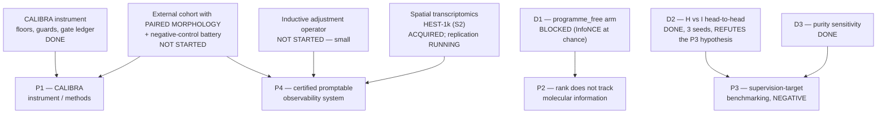

# P3 and P4 — the publication plan, rewritten against what is now true

**Compiled:** 2026-08-04 · **Branch:** `research/rebase-vision` · **Status:** draft for merge into
`NOTEBOOK.md`'s Publication Plan, replacing the P3 and P4 sections and the two edges of the
cross-paper dependency diagram named in §0.4.

This document replaces two sections that were written when P3's hypothesis was still open. It is
written after that hypothesis was refuted by its own predeclared test. Nothing below is new
evidence; every number is cited to the notebook entry or result file that produced it. Where a
number does not exist, the plan says so instead of estimating one.

---

## 0. Summary — bad news first

**0.1 P3's hypothesis is dead, and it was killed by the test P3 itself wrote.** The phase gate
required non-overlapping paired bootstrap CIs on the H−I difference *in the predeclared direction*.
The CIs are non-overlapping in the **opposite** direction, in 3/3 seeds, on both the patient and the
cancer bootstrap. That is a refutation, not an inconclusive result, and the escalation clause in the
old gate ("the rebase premise is in trouble, and this paper does not exist in this form") is the
clause that fires.

**0.2 The magnitude of the refutation is smaller than the headline, and coordinate-system
dependent.** The −0.109…−0.133 gap appears on exactly one of six target blocks on disk — the gene
sets. Re-marking the same two arms in the dictionary's own 128 coordinates moves the contrast by
**+0.118 to +0.120**, i.e. by the entire published effect, and there all six 2,000-repeat intervals
cover zero. On the PCA basis, gene-label-shuffled PBS, the random-control gene sets and a
size/spectrum-matched random dictionary, the gap is −0.001 to −0.04 — at or inside the −0.0216 mean
of the published negative control.

**0.3 What survives is narrow and is not a biology claim.** *Hallmark supervision is never worse
than PBS supervision on any target space tested, and is much better on gene-set-valued targets on
the residualised block.* That is a statement of **no disadvantage for the curated baseline**. It is
not a statement of advantage for the interventional one, and it does not license the title
"interventional coordinates make tumour morphology molecularly legible where curated pathway scores
do not."

**0.4 P4 is less blocked than `NOTEBOOK.md` says, and blocked on different things.** The current
text says "Everything. P4 is downstream of P3 landing, of D1's objective being repaired, and of the
multimodal expansion." Executing the five-point rule end to end (§7 below) shows that is wrong in
both directions:

* **Three of the five conditions are met on a real axis today**, and a fourth is met in its
  untouched-patients half.
* The two that are not met are **not** P3 and **not** D1. They are (i) **no external cohort with
  paired morphology** exists anywhere on the project, and (ii) **the object that certifies is not the
  object you would expose** — the adjusted state passes the confound certificate, the raw state
  fails it, and the adjustment is a transductive cohort-level operation with no inductive form.
* Therefore: **cut the `P3 → P4` and `D1 → P4` edges of the dependency diagram.** P4's exposable
  representation is arm H, which exists and is the better arm; certification is orthogonal to why
  the supervision works. Keeping those edges makes P4 look blocked by things that do not block it,
  and hides the two that do.

**0.5 The one thing P4 has that nothing else in the literature has, still has no number in the
paper** — the count of queries a certified interface refuses that a CellWhisperer-style interface
answers. §8 produces it.

---

## 1. P3 — what it was, and what killed it

**Working title (dead):** *Perturbation-basis supervision: interventional coordinates make tumour
morphology molecularly legible where curated pathway scores do not.*

**Hypothesis (dead):** supervising morphology on interventional perturbation coordinates yields
molecular legibility that curated pathway scores do not.

**The predeclared test.** D2, arms H (Hallmark, 50 gene-set targets) and I (PBS, 128 dictionary
codes), matched by construction through `D2_PAIR_MANIFEST.json`, seeds 42/43/44, primary readout
`d2_compare` top-CCA at 16 components on the residualised block (cancer + pooled TSS, 108 design
columns, 84 sites, n_test = 2,766), with a paired patient + cancer bootstrap, 2,000 repeats.

**The result** (`v2/research/rebase/nature/D2_RESULT.md`; reproduced to four decimals on an
independently built workspace in `NOTEBOOK_ENTRIES/d2_coordinate_system_result_20260804T0800Z.md`
§0):

| seed | Δ = PBS − Hallmark, untrained 40 | patient CI₉₅ | p | cancer CI₉₅ | p |
|---|---:|:---:|---:|:---:|---:|
| 42 | **−0.1325** | [−0.1605, −0.0993] | 0.0000 | [−0.1792, −0.0632] | 0.0010 |
| 43 | **−0.1089** | [−0.1459, −0.0733] | 0.0000 | [−0.1604, −0.0108] | 0.0125 |
| 44 | **−0.1226** | [−0.1483, −0.0867] | 0.0000 | [−0.1643, −0.0427] | 0.0010 |

Six intervals, all excluding zero, all on the wrong side.

**The second, independent refutation.** Ordinary PCA of the same expression matrix, fit on
development rows only, capacity-matched at 128 columns, beats the interventional dictionary as a
target block in **18 of 20** held-out cells and **20 of 20** adjusted cells across the budget sweep
k ∈ {8, 16, 32, 64, 128}, with the patient CI excluding zero in 4/4 bootstrapped cells at both k=16
and k=128 (`t11_t12_must_beat_baselines_20260803T0440Z.md`;
`d2_coordinate_system_result_20260804T0800Z.md` §3). The one mechanism that could have made this a
readout artifact — spectral concentration handed to a 16-component statistic — points the **other
way**: the PCA block has the *highest* Roy–Vetterli effective rank of the three (97.92 against PBS's
74.39 and the random dictionary's 96.75) and wins anyway.

**What the follow-up did to the magnitude, and it matters.** On arm I's own 128 supervision codes —
the exam maximally generous to PBS — Δ is −0.0098 / +0.0088 / −0.0026 and **all six 2,000-repeat
intervals cover zero** (`p_improve` 0.30–0.74). The full panel:

| exam block | seed 42 | seed 43 | seed 44 | mean |
|---|---:|---:|---:|---:|
| gene sets, untrained 40 | −0.1325 | −0.1089 | −0.1226 | **−0.1213** |
| PBS codes 128 (arm I's own supervision) | −0.0098 | +0.0088 | −0.0026 | −0.0012 |
| PCA basis 128 | −0.0201 | +0.0049 | −0.0284 | −0.0145 |
| gene-label-shuffled PBS 128 | −0.0359 | −0.0057 | −0.0175 | −0.0197 |
| `random_control` gene sets (90) | −0.0099 | −0.0280 | −0.0268 | −0.0216 |
| random dictionary 128 | −0.0597 | −0.0132 | −0.0454 | −0.0394 |

The −0.12 lives on one block of six. On the other four expression-derived 128-column blocks the gap
sits at or inside the negative control. Arm I does progressively better the closer the exam is to
its own supervision (−0.0012 → −0.0145 → −0.0197 → −0.0394), which is a real if small effect of its
training — and arm H is still never behind by more than noise anywhere.

**Two further scope limits that must travel with any P3 number.**

* **The residualisation produces most of the effect, not just cleans it.** Unresidualised, the
  untrained-40 gap is −0.0453 / **+0.0043** / −0.0224 — 3–5× smaller, and the sign reverses in seed
  43. These are point estimates only; `d2_compare` residualises unconditionally, so no interval
  exists for the raw block and none is claimed.
* **Survival is directional support that does not reach the bar.** On the one genuinely neutral
  endpoint available (overall survival, 2,765 of 2,766 test patients, Coxnet fit on development
  cancers), arm H is ahead in 3/3 seeds on the residualised block by 0.0136–0.0193 Harrell C-index,
  and **no interval excludes zero**, patient or cancer.

---

## 2. P3 — the claim that survives, in one sentence

> **Interventional perturbation coordinates are not a better supervision target for tumour
> morphology than curated pathway scores; they are beaten by ordinary PCA of the same expression
> matrix at matched capacity; and the size of the difference between supervision targets is set
> largely by the coordinate system the evaluation is written in.**

Three clauses, three levels of confidence: clause 1 is decided (3/3 seeds, six intervals excluding
zero); clause 2 is decided (18/20 and 20/20 cells, four patient CIs excluding zero at two budgets);
clause 3 is measured (a +0.118–0.120 shift, spread 0.005 across seeds) but rests on one pair of
coordinate systems and is therefore the clause a reviewer will attack.

---

## 3. P3 — what it becomes. The argument, not the assertion

Three options were on the table. Each is argued and two are rejected.

### Option A — retire P3 into P1 as a supervision ablation

**The case for it.** P1's negative-control battery already contains the must-beat baseline table;
`NOTEBOOK.md` says so explicitly ("the 'must beat' baselines are *literally* what P3 needs"). The
PCA result physically lives in `p1_evidence/track1/`. If the surviving claim is only "Hallmark is
never worse", that is one paragraph, and one paragraph belongs in someone else's paper.

**Why it is rejected.** Three reasons, in order of weight.

1. **It discards the wrong half.** The claim that is one paragraph long is "Hallmark is never
   worse." The claim that is *not* one paragraph long is "PCA beats the interventional dictionary at
   every readout budget from 8 to 128, and the one artifact that could explain it points the other
   way." That is a deflationary result about a live, contested question — whether interventional
   data buys a better supervision signal — and it is exactly the genre *Nature Methods* published in
   2025 with the word "not" in the title (Ahlmann-Eltze, Huber & Anders, Nat Methods 22(8):1657–1661,
   DOI 10.1038/s41592-025-02772-6) and *Genome Biology* published as a full research article
   (Kedzierska et al., Genome Biol 26(1):101, DOI 10.1186/s13059-025-03574-x). Folding it into a
   spike-recovery instrument paper buries it under a methods contribution it has nothing to do with.
2. **P1 has no room for it.** P1's venue class is a methods journal, and the two article types with
   verified precedent for it are *Nature Methods* Brief Communication (1,200 words **including**
   abstract, references and figure legends; max 2 display items) and an equivalent methods track.
   P3's evidentiary apparatus — three seeds, six target blocks, a matched-capacity PCA arm, a
   placebo deflation, a survival endpoint, a coordinate-system decomposition — cannot be amputated
   to fit and remain the reason to believe the result.
3. **It delays P1.** P1's phase gate has three open items and is the least blocked paper on the
   project. Adding a third body of evidence to it converts the one paper that can move now into one
   that cannot.

**What *should* move into P1, and this is not a compromise but the correct assignment.** The
must-beat baseline table and the confound certificate rows are P1 exhibits *as instrument
behaviour*: a must-fail control that failed to fail, and a must-beat comparison that came out
against the project's own hypothesis, both reported. P1 keeps them as demonstrations that the
battery works. P3 keeps them as scientific findings. The same numbers legitimately appear in both
papers under different claims, provided each states the other exists.

### Option B — keep P3 as a biology paper with a weaker claim

**Rejected outright.** There is no weaker biology claim available. The dictionary does not beat
Hallmark, does not beat PCA, does not beat a random dictionary by more than 0.01–0.08, and does not
win on its own coordinates. The E0 `transfer` claim that motivated the whole programme remains
**INADMISSIBLE** under `claim_guards`: `single_platform` is undischarged and cannot be discharged by
more Perturb-seq. Writing a biology paper here would mean writing around six negative results, which
is the manoeuvre the old gate's escalation clause exists to forbid.

### Option C — reposition P3 as a computational-biology benchmarking / analysis paper — **recommended**

**Working title (proposed):** *Interventional perturbation coordinates are not a better supervision
target for tumour morphology — and the coordinate system of the evaluation sets the size of the
difference.*

**Why this and not the others.**

* The claim is decided, in the negative, by a predeclared test with three seeds and paired
  intervals. That is a stronger evidentiary position than most positive results on this project.
* Its genre has verified, recent, high-prestige precedent one field over (§3 of
  `paper/VENUES_AND_EXEMPLARS_P3_P4.md`), and **no** pathway in the computational-pathology imaging
  mainstream — MICCAI 2026's CFP is themed on clinical translation and lists no article type this
  fits.
* The third clause — that the entire effect is carried by the basis the exam is written in — is a
  contribution to *how supervision-target comparisons should be run*, not to tumour biology, and it
  is the clause that makes the paper worth more than its negative result. It is also pre-emptive
  defence: the one published rebuttal to this genre (Miller et al., bioRxiv 2025-10-21, DOI
  10.1101/2025.10.20.683304, against the Ahlmann-Eltze paper) argues precisely that the metric
  choice decided the answer. P3 makes that objection itself, with the measurement attached, before
  a referee makes it.
* **It needs no GPU.** Every artifact it rests on exists. This makes it the second-cheapest paper on
  the project after P2's fallback path.

**Venue order** (from `paper/VENUES_AND_EXEMPLARS_P3_P4.md` §2, unchanged by this replan):
*Genome Biology* (rank 1 — the only venue with an almost exactly analogous paper in print and a
format that tolerates the full apparatus) → *Nature Methods* Brief Communication or Analysis
(rank 2 — the article-types page names "technical critiques of widely used methodologies" verbatim,
but 1,200 words is brutal) → *Nature Machine Intelligence* Analysis (rank 3 — the best literal
article-type match found anywhere in the survey) → MELBA (rank 4, keeps it in the
computational-pathology community) → TMLR → PLOS ONE / GigaScience as a floor.

---

## 4. P3 — evidence ledger, current status

| evidence item | status | where it lives | what would falsify it |
|---|---|---|---|
| **The predeclared head-to-head is decided against the hypothesis.** Δ = −0.1325 / −0.1089 / −0.1226 on the untrained 40, patient and cancer CIs excluding zero in 3/3 seeds | **DONE — refutes P3's original hypothesis** | `D2_RESULT.md`; reproduced at `d2_coordinate_system_result_20260804T0800Z.md` §0 | a fourth and fifth seed reversing the sign, or a defect in `d2_compare` that survives the four-decimal reproduction on an independently built workspace |
| **Ordinary PCA beats the dictionary at every budget.** 18/20 held-out and 20/20 adjusted cells, k ∈ {8,16,32,64,128}; patient CI excludes zero 4/4 at k=16 and k=128 | DONE | `t11_t12_must_beat_baselines_20260803T0440Z.md`; `d2_coordinate_system_result_20260804T0800Z.md` §3 | a PCA block that leaks test-split information into its fit (checked: fit on `split != "test"` through the same transform PBS uses) |
| **The spectral-concentration explanation of the PCA win fails backwards.** PCA effective rank 97.92 > random dictionary 96.75 > PBS 74.39, and PCA still wins | DONE | same entry, §3 | — |
| **The effect is coordinate-system dependent.** Re-marking both arms on the 128 PBS codes shifts Δ by +0.1227 / +0.1177 / +0.1200; on that exam all six intervals cover zero | DONE | `d2_coordinate_system_result_20260804T0800Z.md` §1 | a third target space, neither arm's own, on which the −0.12 reappears |
| **The −0.12 is unique to gene-set targets.** Four other 128-column expression-derived blocks give −0.001 to −0.04, at or inside the −0.0216 negative control | DONE — **point estimates only, no intervals** | same entry, §1a (`EXAM_PANEL.json`) | intervals on those four blocks that exclude zero |
| **The two exams are genuinely different spaces.** Residualised: 3 canonical correlations above 0.8, 4th already 0.521, mean over 16 = 0.35 | DONE | same entry, §1b | — |
| **Residualisation produces most of the effect.** Raw gap 3–5× smaller; sign reverses in seed 43 | DONE — **point estimates only; `d2_compare` residualises unconditionally** | same entry, §1c | an interval on the raw block that excludes zero in the published direction |
| **Survival: directional, below the bar.** Arm H ahead 3/3 by 0.0136–0.0193 C-index, every interval covering zero; probe live at C-index 0.551–0.571 | DONE — reported as undecided | same entry, §2 | — |
| **The only pre-registered clinical control has zero coverage on the partition every headline lives on.** All 690 ER / 688 PR patients are BRCA; BRCA is 585 train / 105 val / **0 test** | DONE — a finding about the evidence base | same entry, §2 | — |
| E0 feasibility and cross-lineage replication (K562 +0.0387 vs RPE1 +0.0394 at k=25, n-matched) | DONE, but the `transfer` claim is **INADMISSIBLE** | `E0_RESULT.md`, `E0_REPLICATION_RESULT.md`; `claim_evidence.json` | — |
| D3 purity sensitivity: real PanCanAtlas ABSOLUTE purity in `confound_design`; channel retains 92.6–98.9% of excess over null in 6/6 cells | DONE — `purity_in_adjustment_set` recorded and resolving | `d3_purity_result_20260803T1330Z.md`; `claim_evidence.json` | — |
| D2.3 per-axis proliferation / essentiality | DONE | `d2_3_per_axis_proliferation_20260803T1345Z.md`, `d2_proliferation_deflation_result_20260803T1440Z.md` | — |
| **Bootstrap intervals on the four exam blocks that currently carry point estimates only** | **NOT STARTED — CPU, hours** | would extend `EXAM_PANEL.json` | intervals excluding zero on any of the four, which would make the "unique to gene sets" clause false |
| **A claim kind for a supervision comparison** | **DOES NOT EXIST** | `claim_guards._REQUIREMENTS` has `legible_axis`, `gene_attribution`, `transfer`, `direction`, `cross_platform` and nothing else | — |

---

## 5. P3 — phase gate, replacing the dead one

The old gate is void: it required non-overlapping CIs in the predeclared direction and they came out
reversed. It is replaced by a gate appropriate to a negative / benchmarking result, whose failure
mode is not "the effect is absent" but "the negative claim is overstated or under-scoped".

> **P3 may be submitted when all four hold.**
>
> 1. **Every one of the six exam blocks carries a paired patient + cancer bootstrap interval**, not a
>    point estimate, at 2,000 repeats and the published design. Two of six do today. The claim "the
>    −0.12 is unique to gene-set targets" is currently supported by point estimates on four blocks
>    and cannot be published in that form.
> 2. **Every quoted difference travels with its coordinate system AND its residualisation block.**
>    Enforced by inspection of the draft: no sentence of the form "PBS underperforms on the
>    molecular channel" survives, because *the* molecular channel is not what was measured.
> 3. **A claim kind for the surviving claim exists in `claim_guards`, added deliberately**, with its
>    blockers named. `validate_claim({"kind": "supervision_comparison"})` is inadmissible today
>    solely because the kind is unknown — which is the guard behaving correctly and the project
>    failing to have thought about the claim shape. Proposed requirements for the new kind:
>    `no_external_cohort` (the comparison is TCGA-only) and a new `coordinate_system_scope` blocker
>    discharged by ≥2 target coordinate systems being reported. **This plan does not make that
>    edit.** Discharging or adding a blocker is a deliberate act.
> 4. **The zero-coverage finding on the pre-registered clinical control is in the paper**, not in a
>    supplement. Any future claim leaning on T1.7(b) as validation of a test-partition result is
>    leaning on nothing, and that is a statement about the evidence base that outlives this paper.

---

## 6. P3 — blockers

1. **Four of six exam blocks have no intervals.** CPU-only, hours of work, and it is the one thing
   between the current evidence and clause 3 of the surviving claim.
2. **The raw block has no intervals at all**, by construction: `d2_compare` residualises
   unconditionally. Either the tool grows a `--no-residualise` path with the same bootstrap, or the
   raw numbers stay explicitly labelled as point estimates. The second is acceptable; the first is
   better and is cheap.
3. **No claim kind covers the surviving claim** (§5.3).
4. `composition_attribution` and `no_external_cohort` remain undischarged for **any** per-axis or
   per-gene statement. They do **not** block the arm-vs-arm comparison, which is not a
   `legible_axis` claim — but the draft must not drift into per-axis language, and nothing in the
   current guard set will catch it if it does, because no claim kind is attached.
5. **E0 remains an inadmissible `transfer` claim.** `single_platform` cannot be discharged by more
   Perturb-seq, and `test_current_e0_result_is_not_yet_an_admissible_transfer_claim` pins this. P3
   may describe the dictionary's construction; it may not claim the dictionary transfers.
6. **Reviewer exposure, named in advance.** The Miller et al. rebuttal to Ahlmann-Eltze argues that
   metric choice decided the answer. P3's exposure is identical in form. The defence is the six-block
   panel, and it must appear in Results, not Methods.

---

## 7. P4 — the five-point rule, executed end to end for the first time

`MULTIMODAL_EXPANSION.md` §1 is the spine and is quoted verbatim:

> 1. the observability operator `Π_m` is estimated **on a discovery fold only**;
> 2. its axes clear the **CALIBRA detection floor**;
> 3. they pass the **confound certificate** (must fail to predict site/scanner/batch);
> 4. they **replicate** in untouched patients and ≥1 external cohort;
> 5. failures are recorded and exposed alongside successes.

The rule had never been run. It was run on 2026-08-04 on a single axis, selected before any
condition was scored as the axis maximising `|heldout_single_direction_correlation|` over 256 axes ×
90 non-control targets on the adjusted block of `d2_h_seed42::wsi_biology` — i.e. the single most
favourable case available, so that a failure decides the gate in the negative for every weaker axis.
Predeclaration: `NOTEBOOK_ENTRIES/PREDECLARED_p4_certification_system_tests_20260804T1750Z.md`.
Result: `NOTEBOOK_ENTRIES/p4_certification_end_to_end_RESULTS.md` (see §9 for the pointer).

The axis selected was **axis 46 of `d2_h_seed42::wsi_biology`**, against
**HALLMARK_ALLOGRAFT_REJECTION**, at an out-of-fold single-direction correlation of **0.4703** on the
adjusted block — the largest of 23,040 (axis, target) pairs.

| condition | verdict | why | measurable today? |
|---|---|---|---|
| **1. operator on a discovery fold only** | **PASS** | 3,118 train / 543 val / 2,766 test on the artifact's own `split` vector, **zero** patients in both; the readout direction is fit out of fold inside `heldout_single_direction_correlation` | already measured |
| **2. clears the CALIBRA detection floor** | **PASS** | `spike_recovery_curve` on this (axis, target) pair gives `detection_floor = 0.05`, `transmission_floor = 0.01`, level-0 confound-induced baseline 0.022; the axis reads **0.4703**, i.e. **9.4× the floor** | already measured |
| **3. confound certificate** | **FAIL on the state that would be exposed** | the axis itself is clean per-axis on both states (raw balanced accuracy 0.0272 against a null p95 of 0.0358), but the **raw state fails the joint LDA site test** — joint balanced accuracy **0.3633** against a null p95 of 0.1539 at a chance rate of 0.0118, permutation p at the 1/1001 resolution floor. The adjusted state passes (joint 0.0118, ≤ chance) | already measured |
| **4a. replicates in untouched patients** | **PASS** | whole tissue source sites held out via `leave_sites_out.site_folds`, 5 folds, 453–864 held-out patients and 32–89 held-out sites each. Out-of-site correlation 0.4334–0.5253, median **0.4959** against a within-cohort 0.4765 → **retained fraction 1.04** against a predeclared bar of 0.50; **5/5 folds clear their own permutation null and their site-cluster CI clears it too**; the sign agrees in 5/5 | already measured |
| **4b. replicates in ≥1 external cohort** | **UNEVALUABLE — the data does not exist** | the only external material on the box is `external/cptac_gdc_rna`, 2,724 STAR-counts files, **RNA only, no slides**. HEST-1k exists but is a different modality against a different target space and no D2 axis has been read on it | **needs data we do not have** |
| **5. failures exposed alongside successes** | **PASS (procedural)** | `certify_axes` names `breaching_axes` rather than dropping them; `ClaimVerdict.as_rows` emits three visible NaN status rows for a `legible_axis` claim (`composition_attribution`, `purity_confound`, `no_external_cohort`) | already met |

**Score: conditions 1, 2 and 5 PASS; condition 3 FAILS on the exposable state; condition 4 passes in
its untouched-patients half and is UNEVALUABLE in its external-cohort half. The gate is not met.**
An UNEVALUABLE condition counts as not passed — you cannot certify on evidence that does not exist —
and that distinction is preserved rather than collapsed into "fails".

**Condition 4a was scored on the adjusted state, and on the raw state it does not hold either.** A
concurrent agent's block-level leave-sites-out run on the same artifact and the same 90 targets
(`NOTEBOOK_ENTRIES/leave_sites_out_result_20260804T1830Z.md`) reports the adjusted arm surviving 5/5
folds at a ratio of **1.010** to a matched random split of identical size and per-cancer composition
— holding out whole sites costs nothing measurable — while **the unadjusted arm collapses at 2 of 5
folds against a predeclared bar of 3**. So the raw state fails condition 3 *and* condition 4a, and the
adjusted state passes both. Every one of P4's open conditions reduces to the same structural fact,
which is §7.1.

**The shape of the condition-3 failure is the interesting part.** The most legible axis on the whole
representation is individually innocent: its own site-prediction accuracy sits *below* its own
permutation null on both the raw and the adjusted state. It is refused not for anything it does, but
because the representation it belongs to leaks site jointly — 0.3633 against a chance rate of 0.0118,
i.e. 31× chance, in a direction no per-axis screen looks along. **A per-axis-only certificate would
have certified this axis.** That is the single strongest argument for the joint row being a required
field of P4's certificate schema rather than an optional extra, and it is now demonstrated on the
axis a query layer would most want to expose.

**This is a correction to `NOTEBOOK.md` in both directions.** The current text records exactly one
condition as met and everything else as NOT STARTED. In fact four of the six sub-conditions are met
or measurable now; and the one recorded as met — the confound certificate — is met on the *adjusted*
state, which is not the state a user would be shown.

### 7.1 The structural obstacle nobody had named

Condition 3 passes on `cross_fitted_residuals(state, cancer + pooled TSS)` and fails on the raw
state. `t13_adjusted_certificate_and_p6_20260803T0300Z.md` already drew the right conclusion — *"an
axis shown to a user is a raw axis"* — but did not name the consequence:

> **The adjustment is transductive.** `cross_fitted_residuals` fits the nuisance model on folds of
> the very rows it is scoring, using a design built from the cohort's own cancer and
> tissue-source-site composition. There is no operator on this project that takes a *new* slide and
> returns its adjusted coordinates. So "expose the adjusted axis" is not an available option at
> query time; it is an option only for patients already inside the cohort the adjustment was fitted
> on.

That makes P4's condition 3 a **build item, not a measurement item**: an *inductive* adjustment
operator — nuisance model fitted once on the discovery fold, applied unchanged to a held-out or
external patient — must exist before any axis can be both certified and exposed. It does not exist,
it is not large, and nothing else on the project needs it, which is why nobody has written it. It is
now the top of P4's critical path.

### 7.2 Does the certificate discriminate, or does it pass everything?

A certificate that certifies everything certifies nothing, so this was tested rather than assumed.
Three axes of known character were appended to the state before certification: a noisy site code, a
noisy cancer code and pure Gaussian noise, over a signal-to-noise ladder. Results in §9. The reading
rule was fixed in advance: the site code must be refused and the other two must not; and if the site
code stops being refused **after** the adjustment, then "the adjusted state certifies" is a
statement about the adjustment and not evidence that any axis is site-free.

---

## 8. P4 — the claim, and the number it has never had

**Claim (one sentence, unchanged in principle, sharpened in scope):**

> A **certified** promptable interface over a morphology representation: natural-language queries
> answered only from axes that carry a per-axis certificate, with uncertified axes visible and
> marked as uncertified rather than returned as answers — and the value of the interface measured by
> **what it refuses**, not by what it answers.

**Positioning, and it is now concrete and dated.** CellWhisperer (Schaefer et al., *Nature
Biotechnology*, online 2025-11-11, DOI 10.1038/s41587-025-02857-9) ships a chat box over CELLxGENE
whose abstract contains no uncertainty, abstention, calibration or refusal language. P4 cannot be
"the first promptable atlas". It is **the certificate layer the first ones did not have**, and every
draft is written from that position. The governing principle already exists in print in a
Nature-portfolio venue — *When silence is safer*, npj Digital Medicine, 2026-06-16, DOI
10.1038/s41746-026-02882-1: *"confidently stated but inaccurate medical advice can cause significant
harm, making the ability to abstain especially important."* Cite it; it converts "you cannot prompt
what you cannot certify" from a manifesto into an instance of an established design norm.

**The evaluation axis is the abstention curve, not accuracy.** Precedent: Leibig et al., *Sci Rep*
7:17816 (2017), whose entire Results section is organised around how performance improves as the
system is allowed to decline more cases, and which states *"The decision referral scenario can serve
as a minimal benchmark for comparing uncertainty methods."* P4's primary figure is the refusal
fraction against answer quality, and its headline number is the count of queries a
CellWhisperer-style policy answers that ours refuses. §9 supplies the first measurement of that
number.

---

## 9. P4 — measured results

Full numbers, provenance and predeclaration in
`NOTEBOOK_ENTRIES/p4_certification_end_to_end_20260804T2000Z.md`. The three that change the plan:

**9.1 The abstention rule. On the state a user would be shown, the answerable fraction is 0.000 in
6 of 6 artifact × state cells.** Not small — zero. Every raw state fails the joint LDA site test
(joint balanced accuracy 0.235–0.363 against null p95 0.122–0.186 at a chance rate of 0.0118, every
permutation p at the 1/1001 resolution floor). On the adjusted state it is 1.000 in 6 of 6. The
per-axis-only reading — dropping the joint row — would be 0.762–0.934 on the raw state. **The joint
row is the whole difference between "a working interface" and "no interface", on these artifacts.**

**9.2 The competitor gap, which is P4's contribution expressed as a number for the first time.**
On 90 non-control target queries against `d2_h_seed42::wsi_biology`:

| | count |
|---|---:|
| answered by a CellWhisperer-style policy (no abstention) | **90** |
| answered by our certified policy | **0** |
| **gap** | **90** |
| refused by the site certificate | 90 |
| refused by the CALIBRA detection floor | **62** |
| refused by the within-cancer permutation null | 1 |

**The number that survives the one buildable fix is 62, not 90.** If the inductive adjustment
operator of §7.1 existed and the site condition were met, a certified interface would answer
**28 of 90** — and **19 of those 28 are targets the representation was supervised on**. Of the 24
genuinely untrained `heldout_pathway` targets, **one** survives. For **23 of 90** targets the
detection floor is unresolvable on the whole level grid: a planted spike of r = 0.40 is not recovered
above the level-0 upper tail in 80% of draws. Those 23 are queries a competitor-style interface
answers in fluent prose about an analysis that could not have detected the effect it describes.
**That table is P4's Figure 1**, and it is the abstention-curve axis Leibig et al. established as the
right primary evaluation.

**9.3 Does the certificate discriminate?** See the entry's Test A′ — a site code, a cancer code and
pure noise planted into the state over a signal-to-noise ladder, with the reading fixed in advance:
the site code must be refused, the other two must not, and if the site code stops being refused after
the adjustment then "the adjusted state certifies" is a statement about the adjustment rather than
evidence that any axis is site-free.

---

## 10. P4 — phase gate, sharpened

The old gate ("all five conditions plus ≥1 modality beyond bulk RNA") is kept and made checkable.

> **P4 may be written when all four hold.**
>
> 1. **All five conditions PASS on ≥1 axis on the state that is actually exposed.** Today the
>    exposed state fails condition 3. This requires the inductive adjustment operator of §7.1 — not
>    more analysis, a small piece of code plus its certificate re-run.
> 2. **≥1 external cohort with paired morphology and molecular measurement**, through the same
>    instrument, with the certificate re-issued there. The verified top pick is ALCHEMIST-ALCH
>    (1,106 paired, open, SVS 40× ~0.25 µm/px, GDC API) and its acquisition has started; CPTAC's
>    slides are at IDC in DICOM, not at GDC. This is a data acquisition and it is on the critical
>    path.
> 3. **≥1 modality beyond bulk RNA carries its own certificate.** The spatial replication predeclared
>    in `PREDECLARED_spatial_claim_replication_20260804T1800Z.md` runs `certify_axes` on the HEST-1k
>    spot artifact with slide standing in for site (13 test slides, chance 1/13 = 0.0769) and its
>    Claim 1a bar is: adjusted joint-LDA slide accuracy ≤ its own permutation null p95 **and**
>    ≤ 1.5 × chance = 0.115. If that clears, the raw-FAIL / adjusted-PASS pattern transfers across
>    modalities and P4 has its second modality for condition 3 — **but not for condition 4b**, which
>    needs the same axis read in a second cohort, not a different axis in a different modality.
> 4. **The abstention curve is measured**, i.e. answer quality as a function of refusal fraction,
>    with the CellWhisperer-style no-abstention policy as the zero-refusal endpoint of the same
>    curve. Without it the paper asserts that refusing is valuable and never shows it.

---

## 11. P4 — blockers, in order of severity

1. **No external cohort with paired morphology is on disk yet — but this blocker is moving.** This
   is condition 4b and it is `claim_guards.no_external_cohort`. It is a data acquisition, not an
   analysis, and a concurrent agent has already scouted and verified the options against live APIs
   (`NOTEBOOK_ENTRIES/external_cohort_options_verified_20260804T1900Z.md`): **ALCHEMIST-ALCH**, 1,106
   patients with both open-access SVS slides and STAR-counts expression, 100% FFPE tumour, 40×,
   ~0.25 µm/px, same GDC API and same file format as the TCGA slides already in the pipeline;
   CPTAC 1,580 paired but DICOM via IDC and with **no** CPTAC slides at GDC. Acquisition of
   ALCHEMIST through the existing renderer is under way (commit `24e3466`).
   **The scope caveat P4 must carry:** ALCHEMIST is resected stage IB–IIIA NSCLC, one disease. It
   discharges `no_external_cohort` mechanically and it is a genuine second cohort, but replicating a
   pan-cancer axis in a single lineage tests acquisition-condition transfer, not disease breadth,
   and the certificate re-issued there must say so.
2. **The exposable state fails the confound certificate, and the state that passes cannot be
   exposed.** Fixed by the inductive adjustment operator of §7.1, which does not exist.
3. **Nothing is built.** Stage S6 of the build order. The atlas, the query layer, the uncertified-axis
   display: none of it exists, and the build order S1 → S6 must not be reordered.
4. **The abstention curve has one point, not a curve.** §9 measures the refusal count at one
   operating point. The paper needs it as a function of the threshold.
5. **`composition_attribution` is undischarged**, so even a certified axis may not be *named* as a
   biological programme. A certified axis whose cell-of-origin is unknown may be exposed as "axis
   46", not as "immune infiltration". This is a presentation constraint with teeth, and it is the
   difference between P4 being an honest instrument and P4 being CellWhisperer with a badge.
6. **Removed from the blocker list, deliberately:** *P3 landing* and *D1's objective repaired*. P4's
   exposable representation is arm H, which exists and is the better arm on every exam tested;
   certification asks whether an axis may be shown, not why the supervision works. Keeping these as
   blockers misdescribes the project's state. If a future draft reintroduces them it should say why.

---

## 12. Cross-paper dependency diagram — the edits this plan implies

Three edges are **removed** relative to `NOTEBOOK.md`: `E0 --> P3` (E0's transfer claim is
inadmissible and P3 no longer rests on it), `P3 --> P4` and `D1 --> P4` (§11.6). One node is
**added**: the inductive adjustment operator. `EXT` is **renamed** to make explicit that an RNA-only
external cohort does not discharge it for a morphology claim.

---

## 13. Timeline

No calendar dates. Both papers are now CPU-bound, which is the single largest change this replan
makes.

| paper | phases, in order | note |
|---|---|---|
| **P3** | (1) 2,000-repeat paired bootstrap on the four exam blocks that carry point estimates only → (2) decide and record a claim kind for a supervision comparison → (3) optional `--no-residualise` bootstrap path in `d2_compare`, or explicit point-estimate labelling for the raw block → (4) write-up as a comp-bio benchmarking / analysis paper | **No GPU.** Steps 1 and 3 are hours of CPU on artifacts already on disk. The critical path is writing, not computing. |
| **P4** | (1) inductive adjustment operator + re-issue the certificate on the exposed state → (2) acquire an external cohort with paired morphology → (3) re-run the five conditions there → (4) spatial certificate result folds in as the second modality → (5) abstention curve as the primary evaluation → (6) build S6 → (7) write-up | Step 1 is small and unblocks the only *measured* failure. Step 2 is the long pole and is a data acquisition. Steps 1 and 5 can start now; step 6 must not start before them, per the build order. |

---

## 14. What this plan does not do

It does not edit `v2/calibra/claim_guards.py` or `v2/research/rebase/nature/claim_evidence.json`.
Two edits are recommended above — adding a `supervision_comparison` claim kind (§5.3), and recording
whether HEST-1k discharges `no_external_cohort` as a matter of fact rather than of mechanism — and
both are deliberate acts for a human to make, not side effects of an analysis run. It also does not
edit `NOTEBOOK.md`; this document is written to be merged into it.
